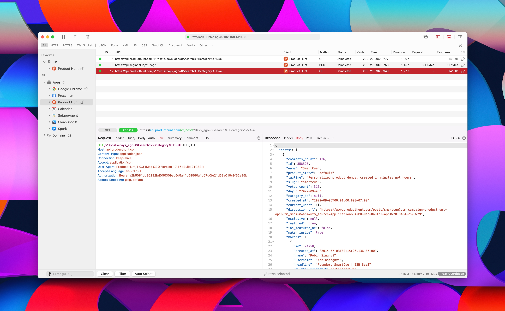

# Overview

## Proxyman

Proxyman is a high-performance macOS app, which enables developers to view HTTP/HTTPS requests from apps and domains, including iOS devices, iOS Simulators, and Android devices.

<figure><figcaption><p>Proxyman for macOS</p></figcaption></figure>

### Features

* [x] ✅ Intercept HTTP/HTTPS (SSL) requests from your Macbook, iOS Simulators, iOS devices, and Android devices 📱.
* [x] Support Apple M1/M2/M3 Chip and macOS Ventura & Sonoma
* [x] ✅ 100% written by Apple Swift NIO for high-performance
* [x] 🦋 Modern and intuitive UI.
* [x] ⭐️ Exclusively native built for macOS. [Windows](broken-reference) app is also available. Linux is soon.
* [x] 👑 Comprehensive debugging tools: Compose, Repeat, ...
* [x] 🛠 Advanced Tools: Map Local, Map Remote, Breakpoint, Allow List, Block List, External Proxying, No Caching, Clear Cache, Protobuf, Scripting (Rewrite), and Diff.
* [x] 👨‍💻 Customizable workspace.
* [x] 🖥 macOS 11 or later

## Download&#x20;

* Download the latest [macOS app](https://proxyman.io/release/osx/Proxyman\_latest.dmg)
* Download the latest [Windows app](https://proxyman.io/release/windows/Proxyman\_latest.dmg)
* Download the latest [iOS app](https://apps.apple.com/us/app/proxyman/id1551292695)
* Download via cask

```
$ brew install --cask proxyman
```

## Github

[Proxyman's Repo Github](https://github.com/ProxymanApp/Proxyman) is where you can create tickets for feature requests, and discussions, or report bugs and catch up with Proxyman's team quickly and efficiently.

> We're welcome all bug reports and feature request 😍

If you'd notify all Proxyman's release. Please Watch the repo

## Milestone&#x20;

You can check the current [Milestone](https://github.com/ProxymanApp/Proxyman/milestones) in Github Repo.&#x20;
