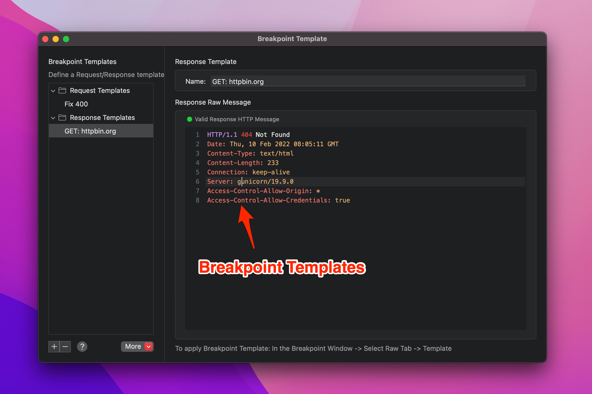
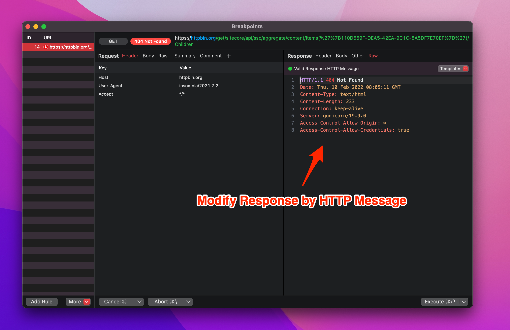

# Breakpoint Templates

## 1. What's it?

From Proxyman 3.1.0+, you can create a Breakpoint Template for Requests and Response that allows developers to reuse it.

* Create new Template for Request: HTTP Method, URL, Headers
* Template for Response: Status Code, Headers
* Boots productivity when using the [Breakpoint tool](breakpoint.md#1.-whats-it).

## 2. How to create a new template?

### Create a new one

1. Tools Menu -> Breakpoint -> Breakpoint Template
2. CMD+N or SHIFT+CMD+N to create a template for Request/Response
3. Defind your Request/Response template

### Use the existing one

1. Create a Breakpoint Rule -> Make sure your request/response -> Make sure it hits the Breakpoint
2. Click Raw Tab -> Template button -> Request/Response -> Create new request/response
3. Done

## 3. How to use it?

1. When a request/response hit a Breakpoint -> Click Raw Tab
2. Template -> Request/Response -> Select your template
3. It will replace the current data with the template one.

