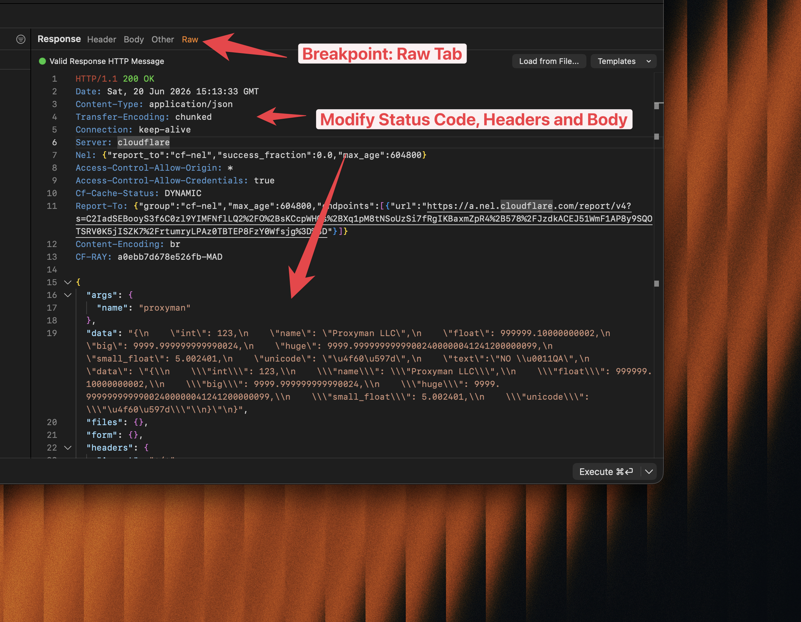

# Breakpoint

## 1. What's it?

Breakpoint is a handy tool to help developers to edit the content of the Request and Response **on the fly**.

It's possible to set a breakpoint on both **Request** or **Response.**

<figure><figcaption></figcaption></figure>


If you're using [Atlantis Framework](../atlantis/atlantis-for-ios.md), you could not use Breakpoint. Please consider using a normal proxy.


## 2. Main features

Breakpoint tool allows the developer to stop an ongoing Request or incoming Response to modify its data.

* Modify the Request URL, including the Scheme, Host, Path, Port, HTTP Method
* Modify HTTP Headers of Request/Response
* Modify Query or Form entry from Requests.
* Modify Authorization/Cookie/Set-Cookie Headers.
* Modify HTTP Body of Request/Response
* Change Response HTTP Status Code.

<figure><figcaption></figcaption></figure>

Raw HTTP Message

From Proxyman macOS 6.12.0 or later, you can switch to the Raw Tab to modify the Request/Response HTTP Message. It allows you to edit the data in 1 place.

<figure><figcaption></figcaption></figure>

### Breakpoint Actions

| Action  | Meaning                                               |
| ------- | ----------------------------------------------------- |
| Cancel  | Cancel a breakpoint and continue the Request/Response |
| Abort   | Abort the connection and return 503 status code       |
| Execute | Make a request/response with a new change             |


Check out Breakpoint Tutorial: [Breakpoint to intercept and edit the requests/response on iOS app](https://proxyman.io/blog/2019/09/Use-Breakpoint-to-intercept-and-edit-request-response-on-iOS-app.html)


## 3. Breakpoint by the Scripting Tool ✅

If you would like to do Breakpoint in an Automatic way, you should use the [Scripting](../scripting/script.md#1-whats-it) tools, which you can achieve the same result that Breakpoint can do, but in a flexible way by writing Javascript Code.

Please check out this [Snippet Code](../scripting/snippet-code.md#2-common-on-request-and-response) to understand how to use Scripting for Breakpoint.

## 4. Breakpoint with GraphQL Requests

From Proxyman 2.27.0+, Breakpoint can work with GraphQL Request by a specific QueryName. Please check out the following GraphQL Document.


[graphql.md](graphql.md)


## 5. How to use

You can simply create a Breakpoint rule by:

1. Make sure Proxyman can capture your HTTPS Request first
2. Right-Click on the Request to show the menu context -> Tools -> Breakpoint
3. Proxyman will open a Breakpoint Window and fill the Matching Rule.
4. Select Breakpoint on Request or Response or both.
5. Click Add to create a rule.
6. Try sending a Request again -> Proxyman will open a Breakpoint and you can modify the data.
7. Click on the Execute Button to send a request/response.

<figure><figcaption></figcaption></figure>
