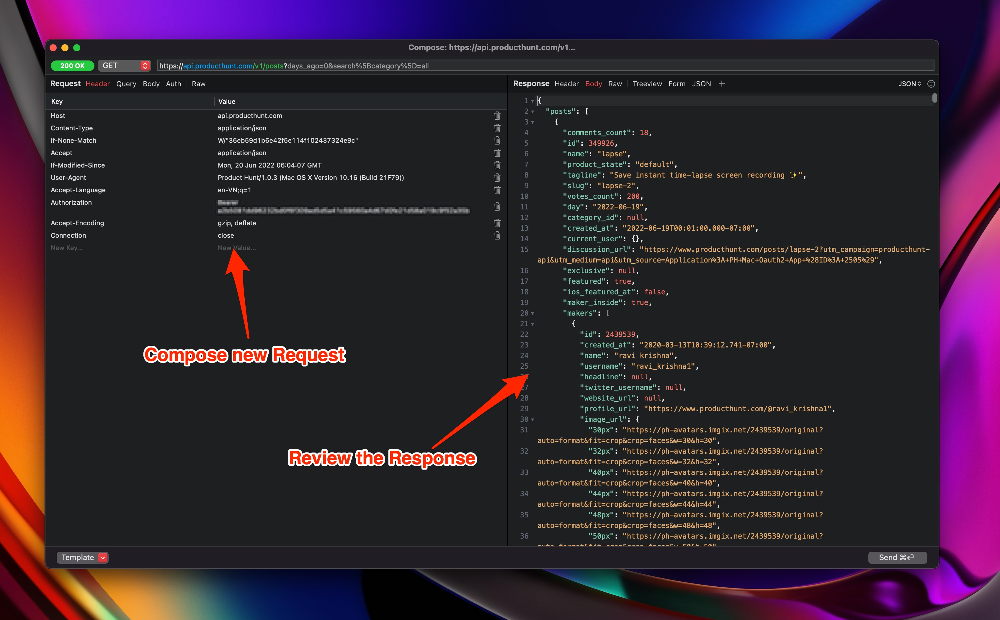
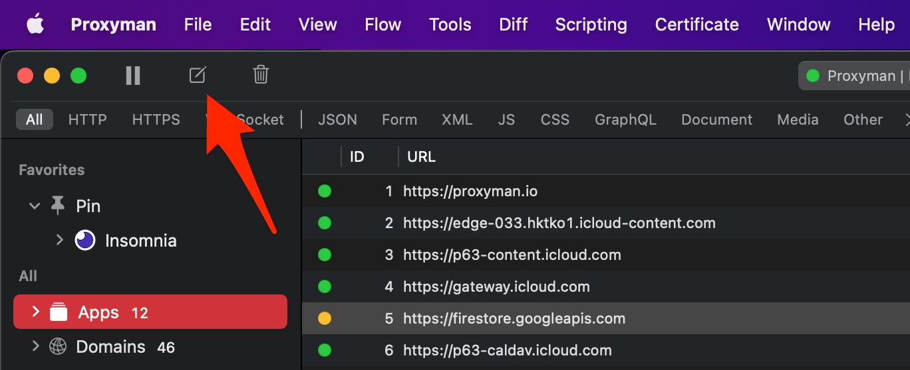
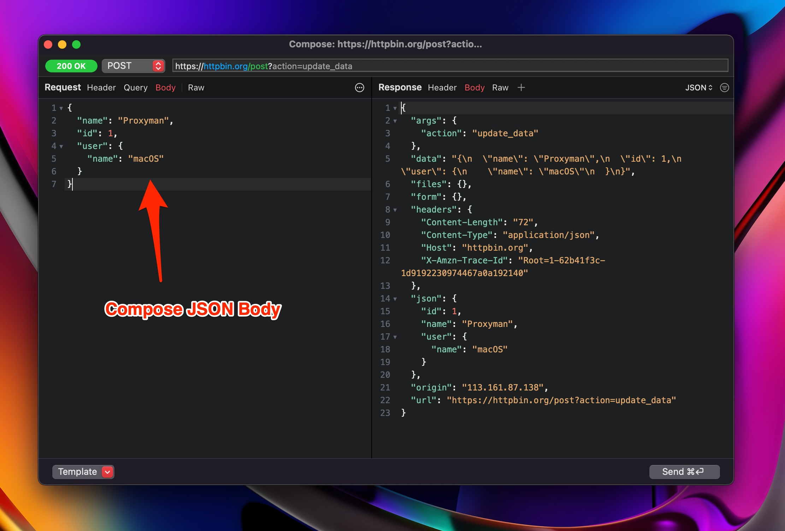
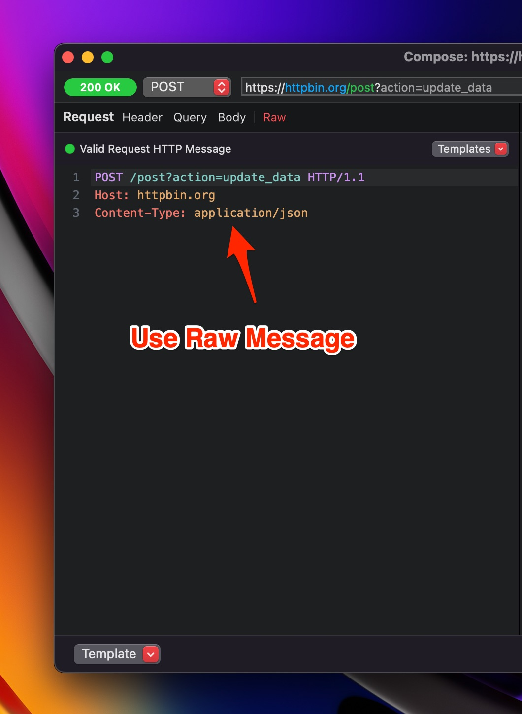

# Compose new Request

## 1. What's it?

Compose a new Request is a handy tool to help developers:

* Compose an HTTP/HTTPS Request and send it to your service. It's similar to Paw, Insomnia, and Postman.
* Quickly test your APIs without depending on your app client.
* Support Header, Query, URL, Form, JSON Body
* Support Raw Message
* Preset template: Empty Request, GET Request, Post Request with JSON or Form.


You can reuse your request data for new requests. Please check out the [Edit & Repeat](edit-and-repeat.md) page.


## 2. How to use

You can open the tool by either:

* Click on the Compose button on the main navigation bar
* Tools -> Compose

1. Enter the URL
2. Select HTTP Method
3. Modify the Header, Param, Body, Raw Message
4. Click the Send button.

 

## 3. Template

Proxyman also supports a few request templates.

* GET with Query
* Post with JSON
* Post with Form
* Post with multiparts
* Import from cURL

## 4. Import from cURL

You can import your cURL, which you can copy from a Network Tab in Google Chrome and make a request with the Compose Tool.

<figure><figcaption>
import cURL
</figcaption></figure>

## 5. Settings

* **Request Timeout**: In Setting -> Tools Tab -> Request Timeout: Define a second that the Request will timeout. Use 0 to disable it. Available on Proxyman 4.13.0 or later
