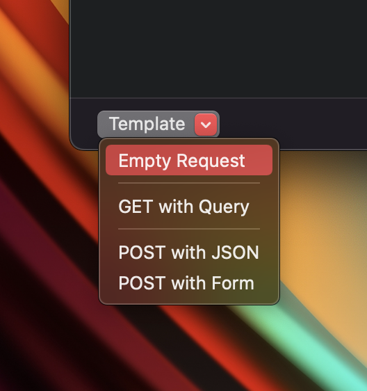

# Compose new Request

### 1. What's it?

Compose a new Request is a handy tool to help developers:

* Compose an HTTP/HTTPS Request and send it to your service. It's similar to Paw, Insomnia, and Postman.
* Quickly test your APIs without depending on your app client.
* Support Header, Query, URL, Form, JSON Body
* Support Raw Message
* Preset template: Empty Request, GET Request, Post Request with JSON or Form.


You can reuse your request data for new requests. Please check out the [Edit & Repeat](edit-and-repeat.md) page.


### 2. How to use

You can open the tool by either:

* Click on Compose button on the main navigation bar
* Tools -> Compose

1. Enter the URL
2. Select HTTP Method
3. Modify the Header, Param, Body, Raw Message
4. Click Send button.

 

### 3. Template

Proxyman also supports few request templates.

### 4. Settings

* **Request Timeout**: In Setting -> Tools Tab -> Request Timeout: Define a second that the Request will timeout. Use 0 to disable it. Available on Proxyman 4.13.0 or later
