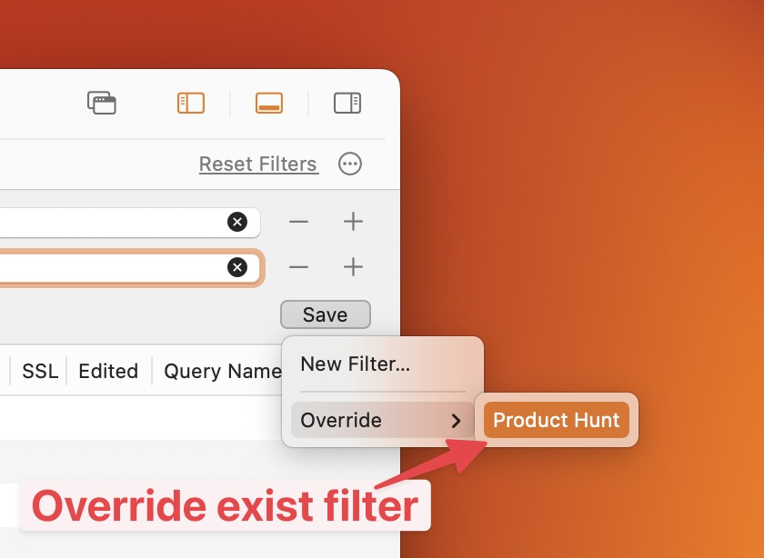

# Custom Filters

## 1. What's it?

From Proxyman 4.11.0 or later, users can create a filter to save current filter configs and access it later.

* Able to create a custom Filter button on the Toolbar with the current filter config
* Manage the filter buttons: Create new, Override, Delete, and Rename.
* Save time ✅

## 2. How to use

#### Create new filter

1. Setup your filter config (Support Single or Multiple filters)
2. Click on the Save button -> Save -> Enter the name
3. A New Filter is added to the Filter Toolbar.

<figure><figcaption>
Create new custom filter
</figcaption></figure>

#### Override&#x20;

1. Change your filter config
2. Save button -> Override -> Select the filter that you'd like to override

<figure><figcaption>
Override current filter
</figcaption></figure>

#### Delete or Rename

1. Right-click on the filter button&#x20;
2. Delete or Rename

<figure><figcaption>
Delete or Rename
</figcaption></figure>
