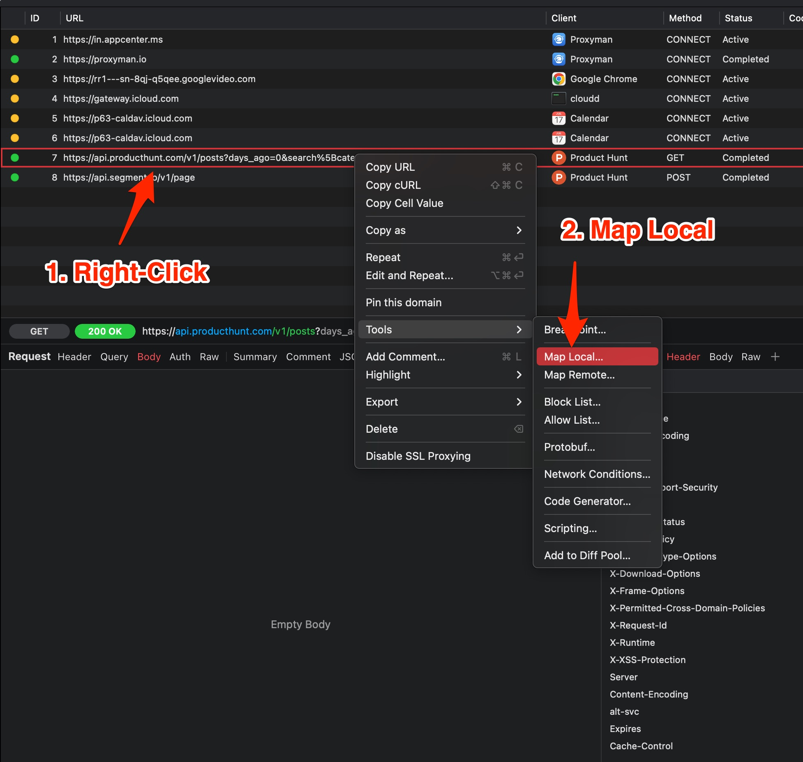

# Map Local (File)

## 1. What's it?

The Map Local Tool enables you to use the content of local files as an HTTP Response to your requests.


You can do Map Local for **GraphQL** with the Scripting Tool ([Snippet Code](../scripting/snippet-code.md#map-local-with-graphql))

You can combine **Map Local with Breakpoint** to modify the content on the fly (2.16.0+)


## 2. Benefits

* Define a Response with Status Code, Headers, and Body -> Mock to a given Request -> Easily to test some edge cases without waiting for the server's update.
* **Mock Fake API with a local File**: It's useful for developers to try out the testing APIs that are not in production.&#x20;


### With an HTTP Message

1. Right Click on your request on the main table -> Tools -> Map Local -> Proxyman will automatically create a new rules with a current Response
2. Feel free to change the Status Code, Headers and the JSON Body
3. Done
4. Re-sent your request -> New Response is mapped.

### With a Local File

* Click on the `Select Local File` button and select any files. Supports: Text, JSON, Binary, Image

### With \<FILE\_URL> flag

* It's useful to map to a given file and able to provide the Status Code and Response Headers.
* Work with JSON, Text, Binary, Image etc
* Make sure to provide `Content-Type` header, so your client can work properly

```json
HTTP/1.1 200 OK
Content-Type: application/json

<FILE_URL="~/Desktop/myjson.json">
```

## 2. How to use

1. Right-click on the Request (which already has a Response) -> Tools -> Map Local. Proxyman will create a  rule with the current Response Body (The file is stored in your Desktop folder)
2. We can directly change the Response body.
3. Make a request and observe the new Response Body.

<figure><figcaption><p>Create a Map Local with curernt Response</p></figcaption></figure>

## 3. Map Local with GraphQL Requests

From Proxyman 2.27.0+, Map Local can work with GraphQL Request by a specific QueryName. Please check out the following GraphQL Document.


[graphql.md](graphql.md)


## 4. Map Local with Scripting Tool ✅&#x20;

If you would like to do Map Local with **complicated rules,** you might check out [Scripting](../scripting/script.md#1-whats-it) since it's easier to achieve the same result.

Please check out these [Snippet Code](../scripting/snippet-code.md#2-common-on-request-and-response) to understand how to map a local file with Javascript Code.
