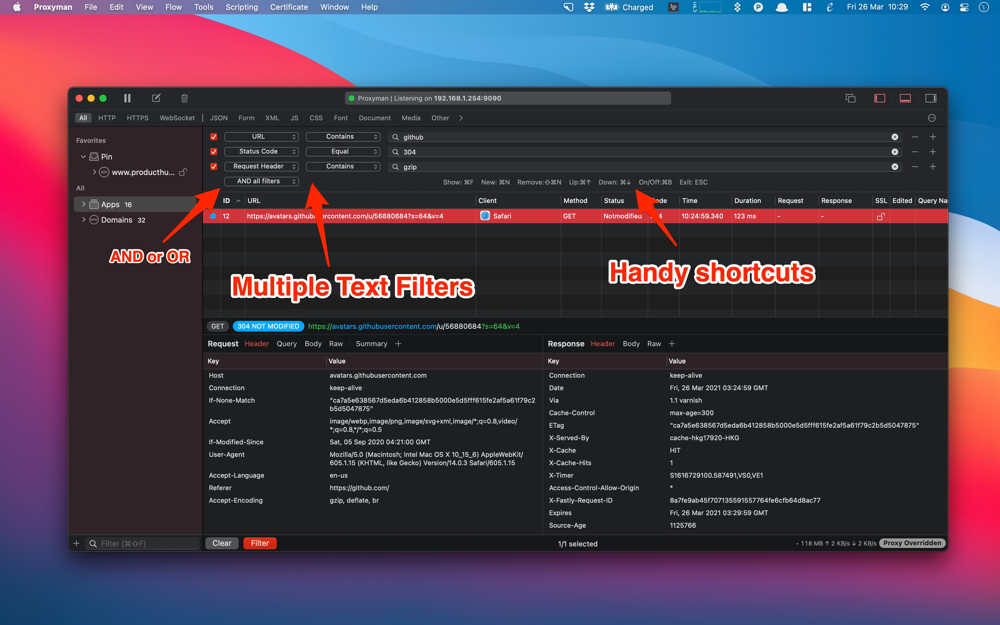

# Multiple Filters

## 1. What's it?

From build 2.22.0+, you can combine many filters at one time.

* Easily and quickly filter the request/response with complex filtered criteria
* Persist your last filter configs
* Handy Shortcuts
* Various Filters: URL, Request Header, Response Header, Body, Status Code, Method, Color, and Comment
* Combine with AND / OR all filters

### 2. Shortcut

| Shortcut | Description                                  |
| -------- | -------------------------------------------- |
| ⌘F       | Display the filter and focus on the last one |
| ⌘N       | Clone new filter                             |
| ⇧⌘N      | Remove current Filter                        |
| ⌘↑       | Focus on the previous filter                 |
| ⌘↓       | Focus on the next filter                     |
| ESC      | Dismiss the filter                           |


Proxyman limit the maximum filters is 10

For a Freemium version, it's limited at 2

