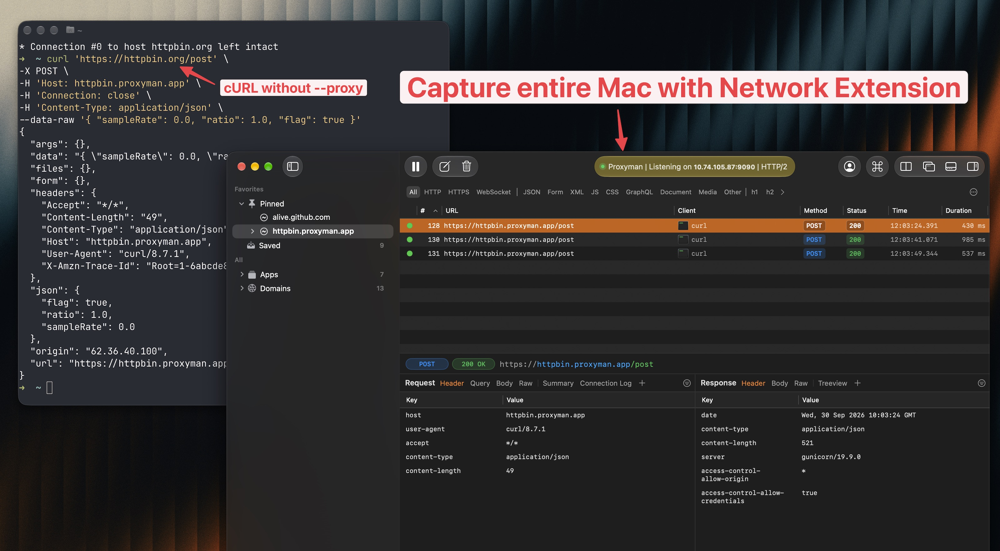
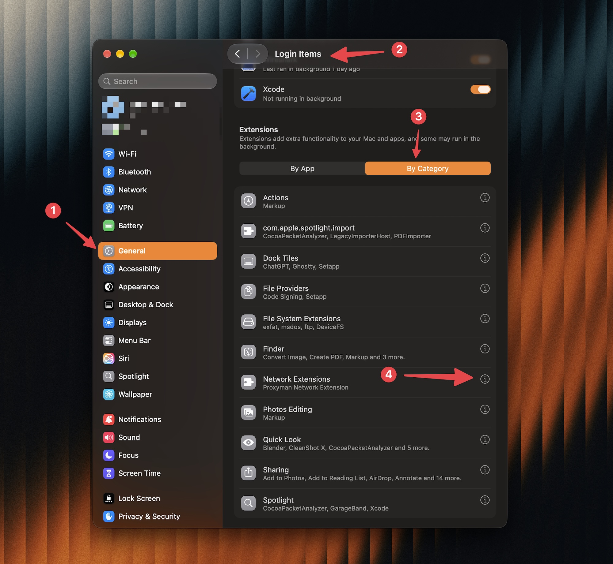
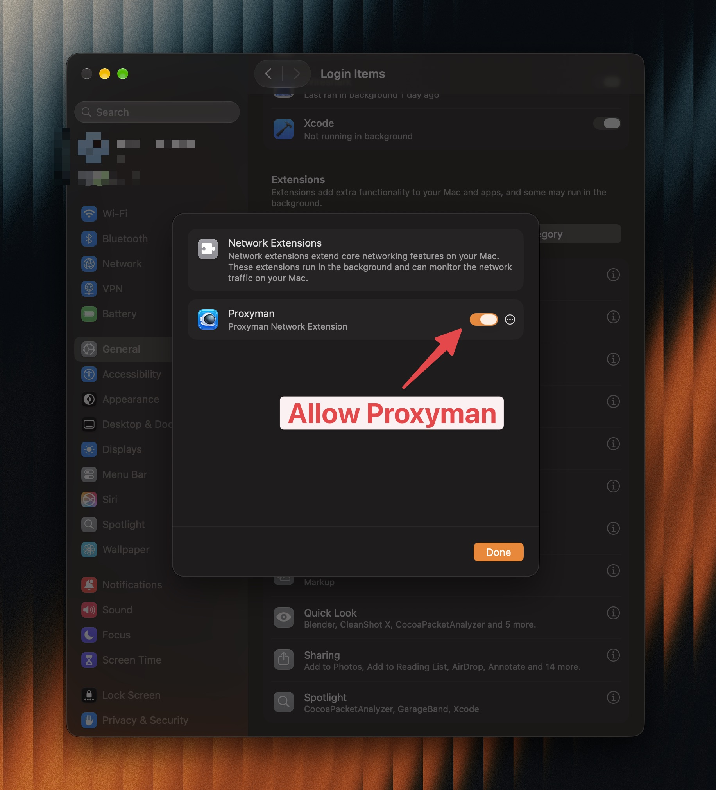

# Network Extension

## 1. What's it?

Network Extension captures HTTP/HTTPS traffic from apps on your Mac, including apps that ignore the system proxy.

It's built on Apple's [transparent proxy Network Extension API](https://developer.apple.com/documentation/networkextension/netransparentproxyprovider). It runs as a macOS system extension, signed with our TablePlus Inc Developer ID certificate and notarized by Apple.

It works similarly to Network Capture mode in Fiddler Everywhere and Local Capture mode in mitmproxy. You don't need to set a proxy in each app.


Network Extension is BETA and off by default. It requires Proxyman PRO and is only available on macOS 26 or later.


<figure><figcaption>
Capture cURL requests without the --proxy flag
</figcaption></figure>

## 2. Problem

Regular proxy mode relies on apps sending their requests through the proxy.

* Some apps and scripts ignore macOS's system proxy, so Proxyman misses their requests.
* NodeJS, Ruby, and Python libraries may need separate proxy settings, code changes, or Automatic Setup.
* Setting up each app or library by hand takes time and can lead to mistakes.

## 3. Benefits

* Capture traffic from apps and scripts that ignore proxy settings.
* Skip manual proxy setup for each app.
* Use existing tools such as Map Local, Breakpoint, and Scripting on captured requests.

## 4. How to install the Network Extension?

1. There are 2 way to do it

* Open Proxyman -> **Settings** -> **Network Extension**.

<figure><figcaption></figcaption></figure>

* Turn on **Enable Network Extension**. Click **Install and Enable** if shown.

or

* Click in the Status Bar and switch the Network Extension ON

<figure><figcaption></figcaption></figure>

2. Open **System Settings** -> **General** -> **Login Items & Extensions**. Under **Extensions**, select **By Category** -> **Network Extensions**, then enable Proxyman.
3. When macOS asks to add the network configuration, click **Allow**.

<figure><figcaption>
Find Network Extensions in System Settings
</figcaption></figure>

<figure><figcaption>
Allow Proxyman Network Extension
</figcaption></figure>

5. Wait until Proxyman shows "Capturing HTTP and HTTPS from local applications."

## 5. How to use?

1. Keep Proxyman open with Network Extension enabled.
2. From this point, The network extension will capture all traffic from your Mac, and proxy to Proxyman
3. To read HTTPS content, [install and trust the Proxyman certificate](../debug-devices/macos.md), then enable [SSL Proxying](../basic-features/ssl-proxying.md) for the app or domain.
4. Make a new request from your app, browser, or script. The request appears in Proxyman.

If an app was already running before you enabled the extension, restart it to capture new connections.

To stop capture without uninstalling, turn off **Enable Network Extension** in Settings.

## 6. Troubleshooting

### SSL errors in NodeJS, Ruby, or Python

These runtimes may not trust Proxyman's self-signed certificate, even when you trust it in macOS. Network Extension captures their traffic, but certificate trust still needs setup.

Use [Automatic Setup](../automatic-setup/automatic-setup.md) to set up certificate trust for supported libraries:

1. Open Proxyman -> **Setup** -> **Automatic Setup**.
2. Click **Open New Terminal** and accept the permission prompt if needed.
3. Run your script or restart your server in that new terminal.


If you're using [Automatic Setup](../automatic-setup/automatic-setup.md) or [Manual Setup](../automatic-setup/manual-setup.md), you can turn off **Enable Network Extension** in **Settings** -> **Network Extension**. Keep running your script or server in the terminal configured by that setup.


If the error continues, check the [Automatic Setup troubleshooting guide](../automatic-setup/troubleshooting.md).

## 7. How to uninstall the Network Extension?

1. Open Proxyman -> **Settings** -> **Network Extension**.
2. Click **Uninstall**, then confirm.
3. Enter your Mac password if asked, and restart your Mac if requested.

Uninstalling stops capture and closes connections using the extension. It also removes the network configuration. Proxyman and Proxyman Setapp share the same extension, so removal applies to both apps.
