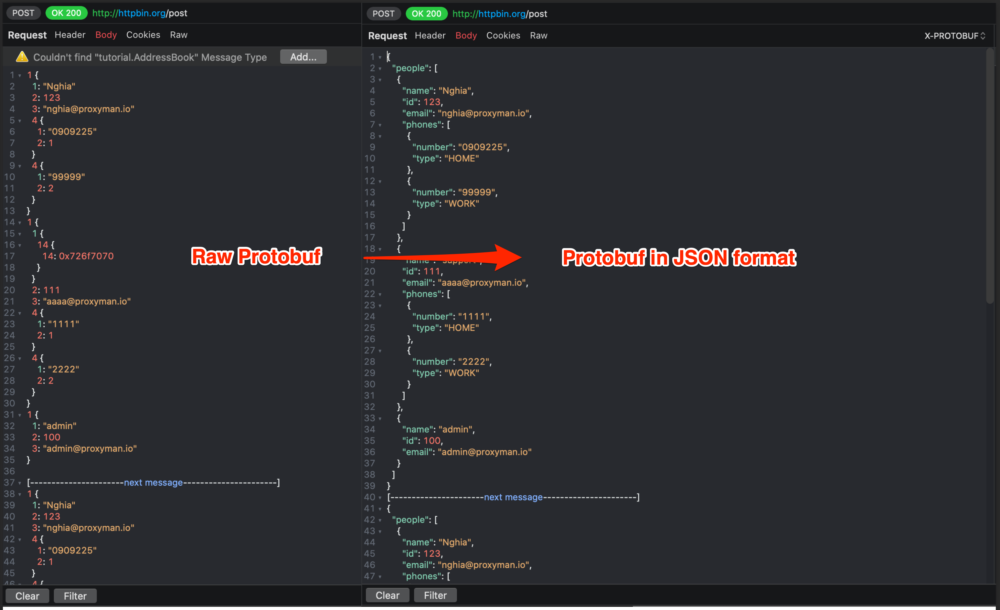
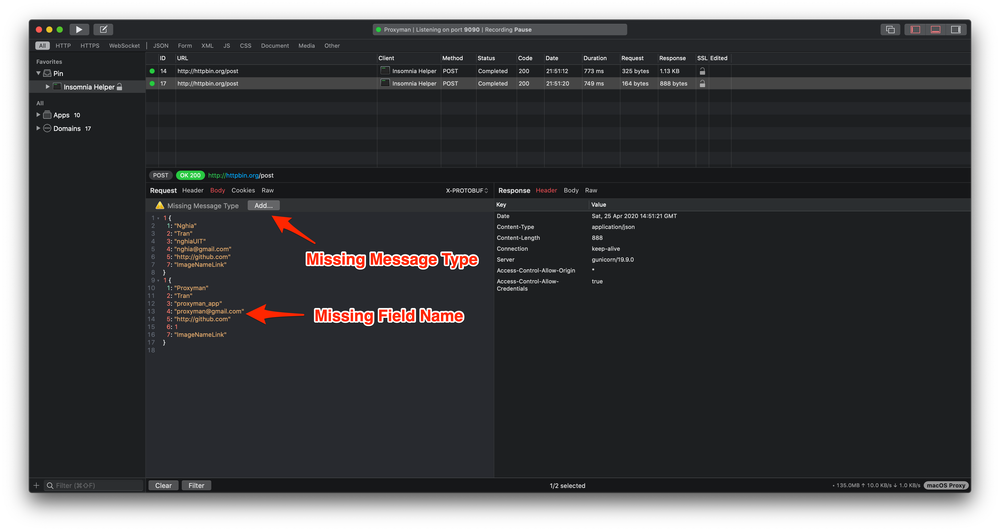

# Protobuf

## 1. Protobuf

* Proxyman macOS can decode your HTTP/HTTPS Request/Response Protobuf Body with a given Protobuf Desc file
* Decode Protobuf binary and show as plain text
* Support Single or Multiple Delimited Messages in a single Protobuf Binary
* Import a desc file and read all Message Type -> Useful to decode protobuf binary
* Decode [Protobuf from Websocket](websocket.md#websocket-with-protobuf-payload)



## 2. Protobuf File Descriptor (\*.desc)

Proxyman requires a File Descriptor (\*.desc) to properly parse the Protobuf Data.

There are various ways to get the File Descriptor:

#### 1. Ask your colleagues.

If your company is using Protobuf, it's a high chance that your colleagues have already had this file, especially the Backend and Frontend teams.

It might be one or multiple descriptor files.

#### 2. Generate from \*.proto file

If you have a bunch of \*.proto files, you can simply generate 1 single \*.desc file by using the following command line.


```bash
# Install protobuf cli if need
brew install protobuf

# Create `input` folder on the Desktop
# Copy all proto files to the `input` folder

# Generate 1 descriptor file with multiple proto files
protoc --descriptor_set_out=output.desc --include_imports -I=/Users/<your_name>/Desktop/input /Users/<your_name>/Desktop/input/*.proto

# Done
# output.desc
```


Once you have the Descriptor File, you can import them to Proxyman:

* Proxyman -> Tools Menu -> Protobuf Schema
* Click on the + button and select the **output.desc** file


Proxyman 3.6.0+ only accepts **File Descriptor (\*.desc)** for better Protobuf parsing.

If you have **\*.proto** files, you can convert them to **\*.desc**. Please check out the next section.



Proxyman automatically imports all common types from **Google Protobuf**, such as Timestamp, Struct, Value, Enum, Method, etc.

Proxyman supports both **proto2** and **proto3** syntax. [Read more](https://developers.google.com/protocol-buffers/docs/proto3)


#### 3. Protobuf Config

Before using Protobuf, you have to configure which Message Type should be used to parse the Protobuf data.

The following table describes which configurations are:

| Name                                | Description                                                                                                                                                         |
| ----------------------------------- | ------------------------------------------------------------------------------------------------------------------------------------------------------------------- |
| Schema                              | Add `.desc` file if need                                                                                                                                            |
| Message Type                        | The Class name of the root object in Protobuf binary. **Must include Package name**                                                                                 |
| Payload Type: **Auto**              | Auto detect if the Protobuf Binary is encoding as a Single Message or [Delimited Message](https://developers.google.com/protocol-buffers/docs/techniques#streaming) |
| Payload Type: **Single Message**    | Single Mesage in a Protobuf Binary                                                                                                                                  |
| Payload Type: **Delimited Message** | Multiple Messages in a Protobuf Binary (Length-Prefix)                                                                                                              |

<figure><figcaption><p>Decode Protobuf HTTPS Resposne with Proxyman</p></figcaption></figure>

## 4. How to use?

There are **two** ways to parse Protobuf properly with qualified name fields:

* Define Protobuf Rules
* Read from Content-Type Header

### 4.1 Define Protobuf Rule

1. Your Protobuf Request should have a Content-Type header, which is `Content-Type: application/x-protobuf` or `Content-Type: application/protobuf`
2. Proxyman detects that it's a Protobuf Payload -> A Warning that Proxyman couldn't parse properly due to the absence of the message type. Click Add to open Protobuf Settings.

Alternatively, you can right-click on your Request -> Tools -> Protobuf



3\. In the Protobuf Rule Window -> Select which Message Type for this request (Add Desc file if needed) for this Request/Response


If you have a different Protobuf Message Type for the Request and Response. Select the \`Use different Message Type for Request/Response\` checkbox



4\. Click Add and see the JSON Format


#### 4.2 Read from Content-Type Header

You can **dynamically** provide the Protobuf Config from `Content-Type`

For example: Your `Content-Type` in the Request or Response might look like:

`Content-Type: application/x-protobuf; messageType="tutorial.Address"; delimited=true`

`Content-Type: application/x-protobuf; messageType="com.proxyman.User"; delimited=false`

To specify that the Protobuf Body this MessageType and the payload encoding.

### 5. Troubleshooting

#### 5.1 Some name fields are missing

There is a situation where some field names are absent because the field name definition is not included in your Protobuf File Descriptor. It might be that your descriptor is out of date.

**Solution**:

* Remove the old Protobuf Schema and add the latest descriptor file from your server.
* If you're using Proxyman 3.5.2 or older, please update to Proxyman 3.6.0 or later. Then, use File Descriptor (\*.desc) for better results.
