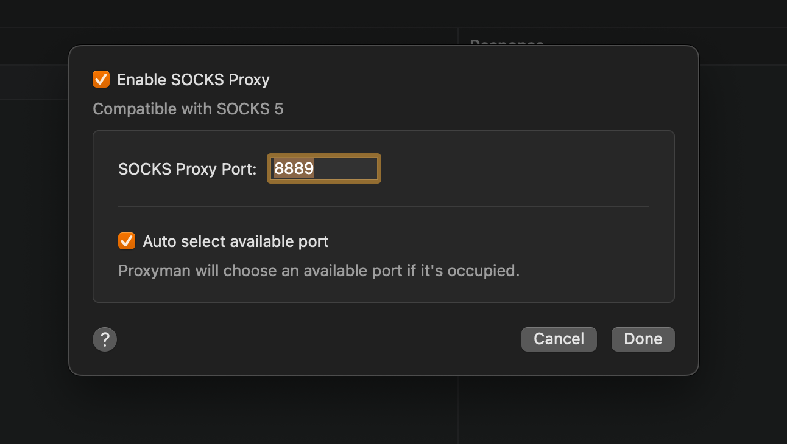

# SOCKS Proxy

## 1. What's it?

From Proxyman 4.9.0, Proxyman supports SOCKS Proxy beside the normal HTTP/HTTPS Proxy.

* Support HTTPS over SOCKS Proxy: All debugging tools (e.g. Map Local, Breakpoint, ...) still work fine.
* Compatible with SOCKS 5


Proxyman app doesn't automatically override the System SOCKS Proxy Setting at launch time. You have to manually enable it if needed.



Proxyman only supports \`connect `` and `udp` command. The`bind` ``command is not supported yet.


## 2. How to use it?

1. Open the SOCKS Proxy Setting in Tools Menu -> Proxy Setting -> SOCKS Proxy Setting
2. By default, Proxyman listens on port 8889&#x20;
3. On your client: Set the SOCKS proxy to 127.0.0.1 at port 8889

<figure><figcaption>
SOCKS Proxy
</figcaption></figure>
