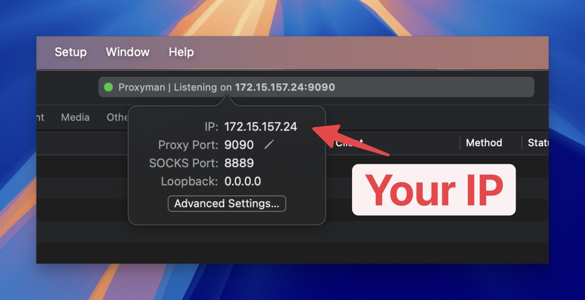

# WebSocket

## 1. What's it?

Proxyman could capture WebSocket (WS) and Secure WebSocket (WSS) traffic and easily preview it.

* Capture WS/WSS from iOS Physical devices and iOS Simulator (Required [Atlantis framework](https://github.com/ProxymanApp/atlantis))
* Capture WS/WSS from Web Browser and Mac applications.
* Capture WS/WSS from Android Physical devices or Android Emulators.
* Prettier WebSocket Message.
* Filter All / Sent / Received messages.
* See the content in JSON / Tree Preview / HEX format.
* Customize Columns: Frame, Length, Data, Time, ...&#x20;
* Auto-decode Binary Message to JSON if possible
* Open WebSocket messages by external Editors, such as Sublime, VSCode


## 2. Capture WS/WSS from Web Browsers

### Localhost websocket

Proxyman can capture localhost websocket, such as ws://localhost:3000, from Google Chrome by using the [Automatic Setup](/broken/pages/OhcRYB7VyVMgZBSLy8fL)

1. Go to Setup Menu -> Automatic Setup
2. Select Google Chrome (New Profile or Current Profile) -> New Google Chrome opens
3. Try to access your localhost websocket here. Proxyman will capture it

### Production websocket&#x20;

Proxyman automatically captures your WS/WSS on Google Chrome, without configuring anything

1. Open Proxyman, and your Google Chrome
2. Make some WS/WSS traffic, such as [https://echo.websocket.org/.ws](https://echo.websocket.org/.ws)
3. Inspect WS/WSS data in Proxyman

<figure><figcaption></figcaption></figure>

### Websocket with Protobuf Payload

From Proxyman macOS 6.5.0 or later, Proxyman can decode your websocket protobuf.

1. Make sure Proxyman can capture your websocket traffic first
2. Right-click on a websocket protobuf message -> Protobuf -> Decode

* **Raw mode**: Useful if you don't have a Protobuf Desc file.
* **Message Type**: Use Message Type from your protobuf desc file.

<figure><figcaption><p>Decode websocket payload with Protobuf</p></figcaption></figure>

## 3. Capture WS/WSS from iOS

If your iOS app is using **URLSessionWebSocketTask** or iOS WebSocket libraries, e.g. Starscream, SocketRocket, etc. Proxyman might not be able to capture WS/WSS traffic.

* **Reason**: Apple's intention. **URLSessionWebSocketTask** doesn't respect the System HTTP Proxy. All WS/WSS traffic goes directly to the Internet. Thus, Proxyman or Charles Proxy can't capture it.
* Example Ap: [https://github.com/ProxymanApp/websocket-example-ios-app](https://github.com/ProxymanApp/websocket-example-ios-app)

### ✅ Solution 1 (Recommended for iOS 17 or later)

1. Follow the Setup guide for your [iOS Devices](../debug-devices/ios-device.md) or [iOS Simulators](../debug-devices/ios-simulator.md) (Make sure we installed and trusted the certificate on your device)
2. Proxyman Setup: Tools > Proxy Settings > SOCKS Proxy settings -> Enable it (Take note of the port)
3. On the main Proxyman app -> Take note of a current IP in the Proxyman Tools bar

<figure><figcaption><p>Get Proxyman current IP</p></figcaption></figure>


4. On your app: Configure a SOCK Proxy in your App, make sure this is only available for debug builds by implementing a switch or something, you might not want your release build with this configuration.

* For NWConnection


```swift
let parameters = webSocketURL.scheme == "wss" ? NWParameters.tls : NWParameters.tcp

let options = NWProtocolWebSocket.Options()
options.autoReplyPing = true

parameters.defaultProtocolStack.applicationProtocols.insert(options, at: 0)

if #available(iOS 17.0, *) {
    let socksv5Proxy = NWEndpoint.hostPort(host: "x.x.x.x", port: 8889) //  Please x.x.x.x with a real Proxyman IP
    let config = ProxyConfiguration.init(socksv5Proxy: socksv5Proxy)
    let context = NWParameters.PrivacyContext(description: "my socksv5Proxy")
    context.proxyConfigurations = [config]

    parameters.setPrivacyContext(context)
}

let connection = NWConnection(to: .url(webSocketURL), using: parameters)
connection.start(queue: .main)
```


* For URLSession and URLSessionWebSocketTask


```swift
private lazy var urlSession: URLSession = {
    let config = URLSessionConfiguration.default
    if #available(iOS 17.0, *) {
        let socksv5Proxy = NWEndpoint.hostPort(host: "x.x.x.x", port: 8889) //  Please x.x.x.x with a real Proxyman IP
        let proxyConfig = ProxyConfiguration.init(socksv5Proxy: socksv5Proxy)
        config.proxyConfigurations = [proxyConfig]
    }

    return URLSession(configuration: config, delegate: nil, delegateQueue: nil)
}()
```


5. Done ✅

<figure><figcaption><p>Capture Websocket from iOS with Proxyman</p></figcaption></figure>

* Credit to [**FranklinSamboni**](https://github.com/FranklinSamboni) **->** [https://github.com/ProxymanApp/Proxyman/issues/586#issuecomment-2125082129](https://github.com/ProxymanApp/Proxyman/issues/586#issuecomment-2125082129)
* Tutorial: [https://proxyman.io/posts/2019-10-18-WebSocket-Debugging](https://proxyman.io/posts/2019-10-18-WebSocket-Debugging)

### ✅ Solution 2

Use [Atlantis Framework](https://github.com/ProxymanApp/atlantis#features) (developed by Proxyman) to capture WS/WSS **URLSessionWebSocketTask** traffic from iOS.

Read more at [https://github.com/ProxymanApp/atlantis](https://github.com/ProxymanApp/atlantis#wswss-traffic)

## 3. Capture WebSockets from your Web Browser (Chrome, Safari, etc)

* Proxyman can capture WS/WSS from a Web Browser out of the box. No need to configure anything.
* How to use: Open Google Chrome -> Visit your website that makes a WS/WSS connection -> Open Proxyman -> Find your websocket domains -> On the Response Panel -> Click Enable SSL Proxying on these domains. Open your Browser, and reload your website -> Proxyman will capture and decrypt WS/WSS ✅

## 4. Capture Websocket from NodeJS, Golang, Python Server

* Proxyman can capture WS/WSS from your NodeJS, Golang, Python, and Ruby server.
* How to use: Read [automatic-setup.md](../automatic-setup/automatic-setup.md "mention") to start your server on this Terminal -> Make a WS/WSS connection -> Proxyman automatically captures and decrypts it ✅

## 5. Map Websocket from Localhost <-> Production

It's possible to map the WebSocket Traffic from localhost <-> Production. Please check out the [Map Remote Tool.](map-remote.md#7.4-map-websocket-from-localhost-to-production)

