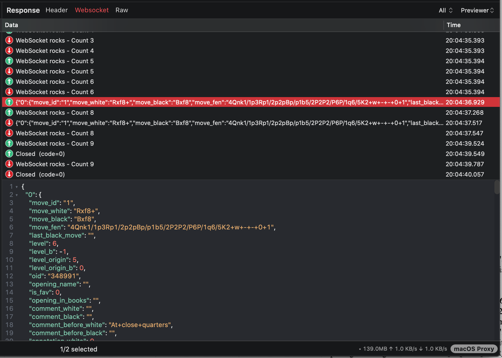

# WebSocket

## 1. What's it?

Proxyman could capture WebSocket (WS) and Secure WebSocket (WSS) traffic and easily preview it.

* Capture WS/WSS from iOS Physical devices and iOS Simulator (Required [Atlantis framework](https://github.com/ProxymanApp/atlantis))
* Capture WS/WSS from Web Browser and Mac applications.
* Capture WS/WSS from Android Physical devices or Android Emulators.
* Prettier WebSocket Message.
* Filter All / Sent / Received messages.
* See the content in JSON / Tree Preview / HEX format.
* Customize Columns: Frame, Length, Data, Time, ...&#x20;
* Auto decode Binary Message to JSON if possible
* Open WebSocket messages by external Editors, such as Sublime, VSCode

## 2. Capture WS/WSS from iOS

If your iOS app is using **URLSessionWebSocketTask** or iOS WebSocket libraries, e.g. Starscream, SocketRocket, etc. Proxyman might not be able to capture WS/WSS traffic.

Reason: It's an intention of Apple. **URLSessionWebSocketTask** doesn't respect the System HTTP Proxy. All WS/WSS traffic goes directly to the Internet. Thus, Proxyman or Charles Proxy can't capture it.

### ✅ Solution 1 (Recommended for iOS 17 or later)

1. Proxyman Setup:\
   Tools > Proxy Settings > SOCKS Proxy settings -> Enable it (Take note of the port)
2. App Setup:\
   Configure a Socksv5Proxy in your App, make sure this is only available for debug builds by implementing a switch or something, you might not want your release build with this configuration.

* For NWConnection

```swift
let parameters = webSocketURL.scheme == "wss" ? NWParameters.tls : NWParameters.tcp

let options = NWProtocolWebSocket.Options()
options.autoReplyPing = true

parameters.defaultProtocolStack.applicationProtocols.insert(options, at: 0)

if #available(iOS 17.0, *) {
    let socksv5Proxy = NWEndpoint.hostPort(host: "192.168.1.4", port: 8889) // Use proxyman socksv5 port
    let config = ProxyConfiguration.init(socksv5Proxy: socksv5Proxy)
    let context = NWParameters.PrivacyContext(description: "my socksv5Proxy")
    context.proxyConfigurations = [config]

    parameters.setPrivacyContext(context)
}

let connection = NWConnection(to: .url(webSocketURL), using: parameters)
connection.start(queue: .main)
```

* For URLSession

```swift
private lazy var urlSession: URLSession = {
    let config = URLSessionConfiguration.default
    if #available(iOS 17.0, *) {
        let socksv5Proxy = NWEndpoint.hostPort(host: "192.168.1.4", port: 8889) //  Use proxyman socksv5 port
        let proxyConfig = ProxyConfiguration.init(socksv5Proxy: socksv5Proxy)

        config.proxyConfigurations = [proxyConfig]
    }

    return URLSession(configuration: config, delegate: self, delegateQueue: operationQueue)
}()
```

Credit to [**FranklinSamboni**](https://github.com/FranklinSamboni) **->** [https://github.com/ProxymanApp/Proxyman/issues/586#issuecomment-2125082129](https://github.com/ProxymanApp/Proxyman/issues/586#issuecomment-2125082129)

### ✅ Solution 2

Use [Atlantis Framework](https://github.com/ProxymanApp/atlantis#features) (developed by Proxyman) to capture WS/WSS **URLSessionWebSocketTask** traffic from iOS.

Read more at [https://github.com/ProxymanApp/atlantis](https://github.com/ProxymanApp/atlantis#wswss-traffic)

### Screenshots



## 3. Map Websocket from Localhost <-> Production

It's possible to map the WebSocket Traffic from localhost <-> Production. Please check out the [Map Remote Tool.](map-remote.md#7.4-map-websocket-from-localhost-to-production)

