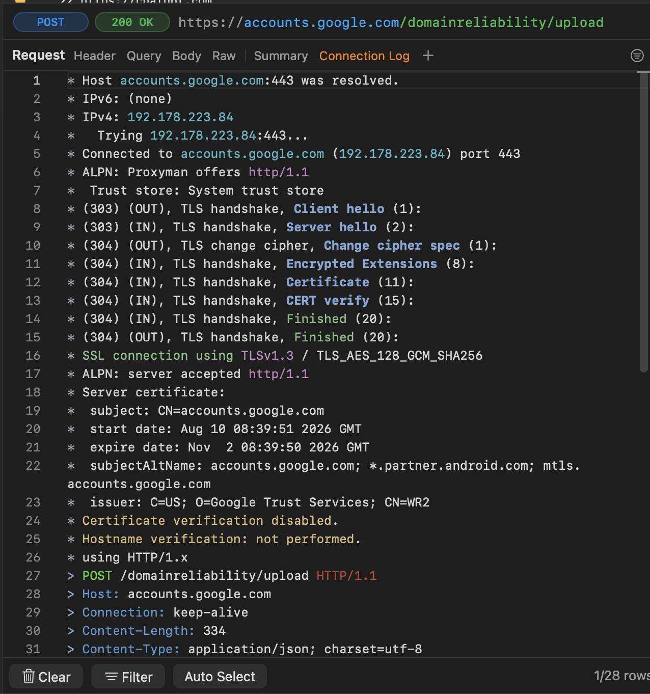

# Connection Log

## 1. What's it?

Connection Log shows how Proxyman connects to a server and sends your request. It uses a text format similar to `curl -v`, with colors to help you find key details.

* Follow the connection from the DNS lookup to the HTTP response.
* See the steps Proxyman captured while handling the request.
* Inspect the connection between Proxyman and the upstream server.
* Read the log in the Request panel, next to Summary.

<figure><figcaption>
Connection Log showing the steps of an HTTPS request
</figcaption></figure>

## 2. Benefits

* Find where a connection failed: DNS lookup, TCP connection, or TLS handshake.
* Check which host and IP address Proxyman connected to.
* See the TLS version and HTTP protocol the server accepted.
* Check the server certificate's name, issuer, and expiry date.
* See whether a request reused an existing connection.
* Save the captured details to review later or share with your team.

## 3. How to use it?

1. Open Proxyman for macOS and capture a request.
2. Select the request in the main list.
3. In the Request panel, click **Connection Log**, immediately after **Summary**.

The tab is enabled by default for new users and existing users after upgrading. The log updates while the selected connection is active.

To show or hide it:

* Click the **+** button in the Request tab bar to open [Custom Previewer Tab](custom-previewer-tab.md).
* Under Request, check or uncheck **Connection Log**.
* Proxyman remembers your choice after restarting.

For HTTPS request and response content, set up the Proxyman certificate and enable [SSL Proxying](ssl-proxying.md) for the domain. Without SSL Proxying, encrypted content stays hidden and fewer connection details are available.

## 4. What does it show?

The log lists the details available for the selected request.

### DNS and TCP connection

* The host name and port.
* IPv4 and IPv6 addresses returned by the DNS lookup.
* Each connection attempt and any failed attempts.
* The IP address and port of the connected server.
* An upstream proxy, when one is used.
* Whether the connection was reused, left open, or closed.

### TLS handshake and certificate

* Protocols offered through ALPN, such as `h2` or `http/1.1`. ALPN lets Proxyman and the server choose an application protocol.
* Handshake steps, such as `Client hello`, `Server hello`, `Certificate`, and `Finished`.
* The negotiated TLS version and cipher suite on the `SSL connection using` line.
* The protocol accepted by the server.
* Certificate subject, issuer, DNS/IP names, and validity dates.
* Certificate and hostname verification results, plus TLS alerts or failures.

### HTTP request and response

* The request method, path, HTTP version, and headers.
* The response status and headers.
* A text response body preview, when available.
* Messages explaining when a body was decoded, modified, or shortened for display.

Use the **Timing Chart** tab when you want to compare DNS, TCP, and TLS durations.

## 5. How to read it?

* `*` marks a connection event or diagnostic message.
* `>` marks request headers sent to the server.
* `<` marks response headers received from the server.
* `OUT` and `IN` show the direction of a TLS message from Proxyman's point of view.

Colors help you scan the log:

* Cyan: host names and IP addresses.
* Purple: TLS versions and ALPN protocols.
* Blue: handshake steps. HTTP header names use the same style as the Raw tab.
* Green: successful handshake steps and verification results.
* Amber: warnings, such as disabled certificate verification.
* Red: failures, such as a rejected certificate or a connection timeout.

`Certificate verification disabled` means Proxyman did not verify the server certificate for that connection. It does not mean the certificate is invalid. Likewise, `Hostname verification: not performed` means that check was skipped.

A reused connection may not show a new DNS lookup or TLS handshake for every request.

## 6. Save and reopen the log

* [Export the flow](import-export.md) as a Proxyman Log `.proxymanlogv2`, or [save the session](../advanced-features/save-session.md).
* Reopen the file and select **Connection Log** to view the saved connection details.
* Proxyman saves the recorded events and builds the displayed log when you open the tab.
* Certificate details are saved as text fields. Full certificates, certificate chains, and private keys are not saved with the connection details.
* Older captures without connection details can still open. The log shows the saved HTTP data and explains that connection details were not recorded.
