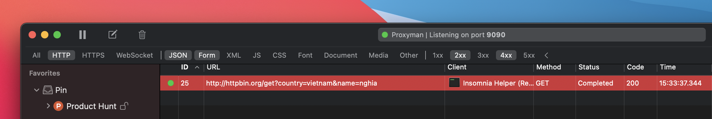

# Content Filter

Proxyman offers the Primary and Secondary Filters to quickly filter out the Requests or Responses you're looking for.


**⌘F: Open** Filter Bar quickly

**ESC** to close the Filter Bar


### Primary Filter:&#x20;

| Filter    | Description                                       |
| --------- | ------------------------------------------------- |
| All       | All Requests and Responses                        |
| HTTP      | Only HTTP                                         |
| HTTPS     | Only HTTPS                                        |
| WebSocket | Only WebSocket and Secure WebSocket               |
| JSON      | Content-Type is application/json or JSON contents |
| XML       | Only XML                                          |
| Form      | Only Form Body in Request / Response              |
| JS        | Only JavaScript content                           |
| CSS       | Only CSS content                                  |
| Document  | Documents content: HTML, ...                      |
| Media     | Image contents: PNG, JPG, GIF, ...                |
| Other     | Other contents which no matching with the above.  |
| Font      | All font family                                   |
| GraphQL   | GraphQL Request (has suffix `/graphQL`)           |

### Status Filters:

| Filter | Description              |
| ------ | ------------------------ |
| 1xx    | Status Code from 100-200 |
| 2xx    | Status Code from 200-300 |
| 3xx    | Status Code from 300-400 |
| 4xx    | Status Code from 400-500 |
| 5xx    | Status Code from 500     |


Hold CMD key and Click to select multiple Types


### Secondary Filter:

#### Content:

* URL
* Query String
* Request Header
* Response Header
* Method
* Status Code
* Comment
* Color

#### Matching:

* Contains
* Not Contains
* Start With
* End With
* Equal
* Not Equal
* Regex

### Header, Query, Auth, Form Filter

From Proxyman 2.34.0+, we can quickly filter the Header, Query, Auth, Form from the selected Request and Response.

1. Click on the view (e.g. Header of the Request)
2. Use Hotkey: CMD + F or Right-Click -> Show Filter to open the filter

