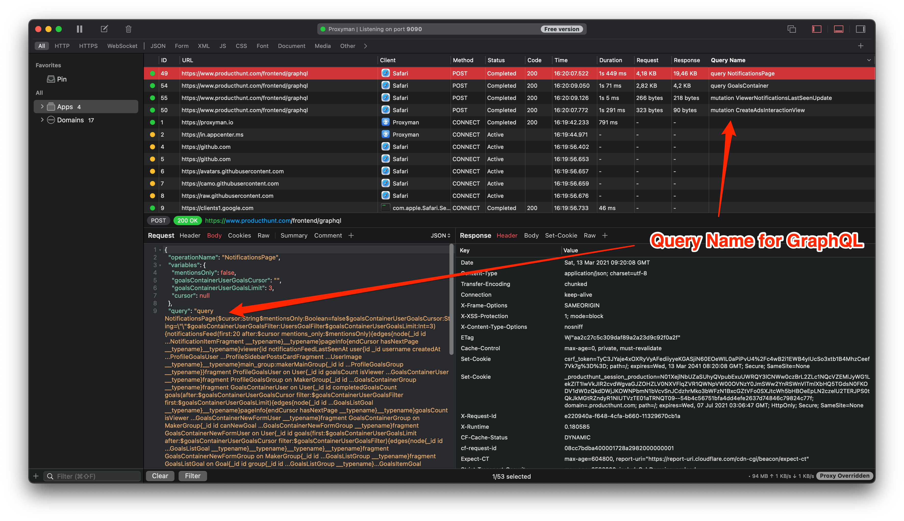

# Custom Header Column

## 1. What's it?

Custom Header Column feature allows you to customize the column that displays on the main Table View. It's similar to Custom Header Column from [Google Chrome Dev Tools](https://developers.google.com/web/tools/chrome-devtools/network/reference#custom-columns)

## 2. Benefit

* Define a Header from Request/Response and show it on the table.
* **Easier to distinguish each request/response if they have the same URL, but different Headers**
* Support resize/sorting/reorder columns
* Remember the previous state and restore it for the future session.

<figure><figcaption></figcaption></figure>

## 3. Custom Column

You can create a custom column from the following items:&#x20;

* ✅ Request Response Header, e.g. Content-Type, X-Key, ...
* ✅ Query, e.g. name, id, ...
* ✅ JSON Body with jq or JSON Path, e.g. $.data.user.name

<figure><figcaption></figcaption></figure>

## 3. How to use it?

1. **Tools Menu** -> **Custom Header Column**
2. Click on the + button on the Request or Response Panel
3. Create new column from Header or Query or JSON Body

<figure><figcaption></figcaption></figure>

Follow this documentation to understand how to use JSON Path or jq to query data from your JSON Data

* [**JSON Path**](jsonpaths.md)
* [**jq**](jq.md)

## **4. Built-in GraphQL Query Column**

Custom Header Column would extract and display the query name for GraphQL Request.

