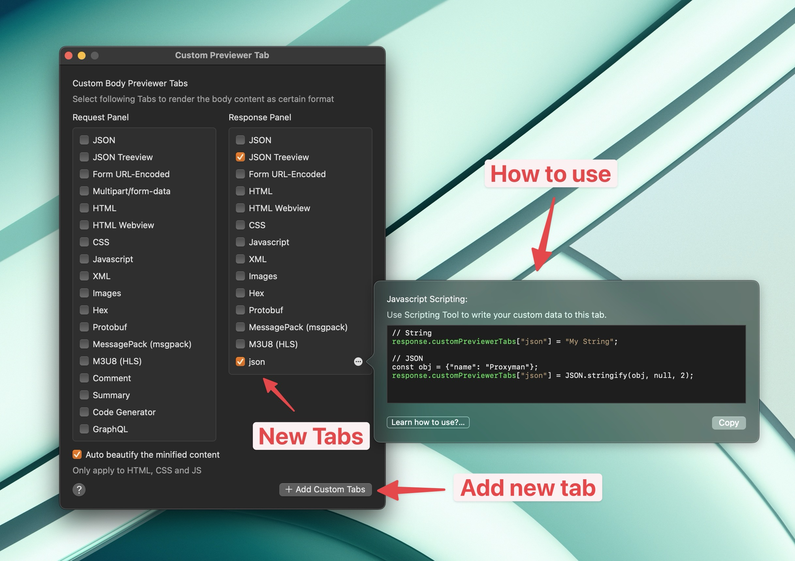
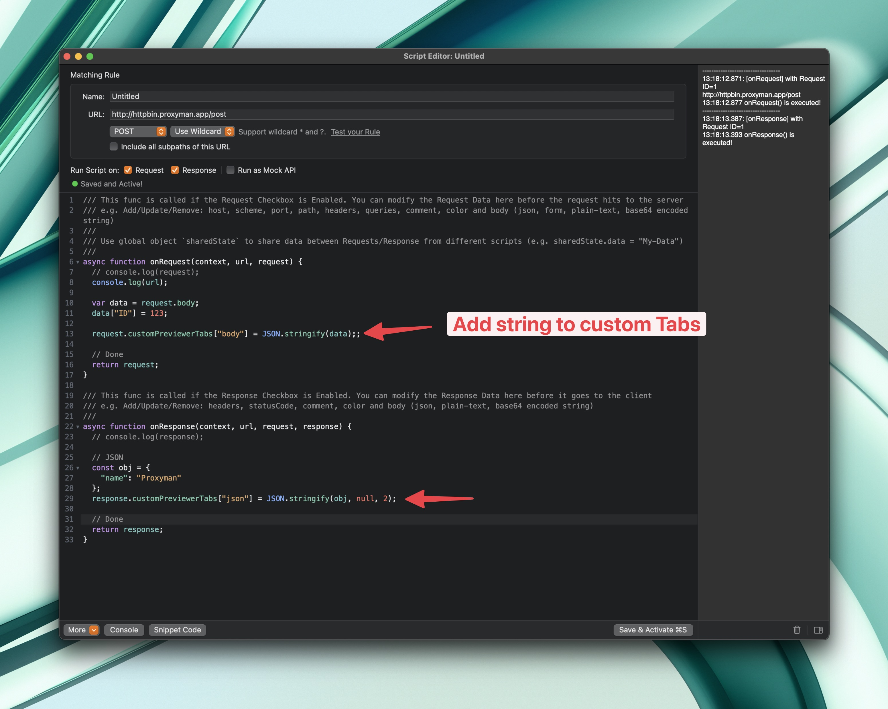
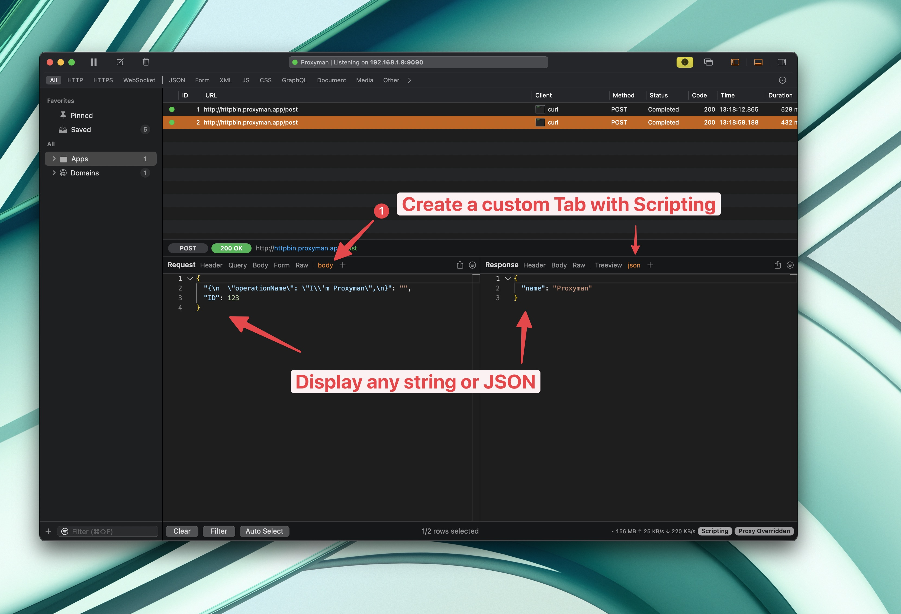
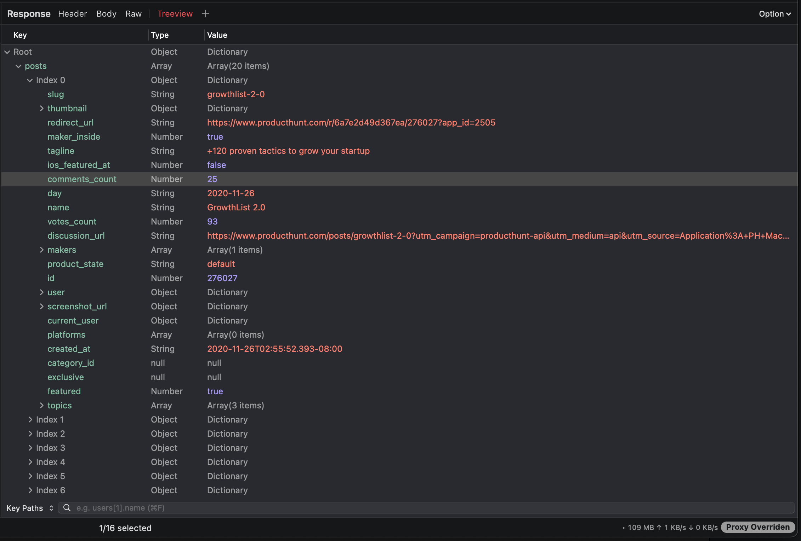
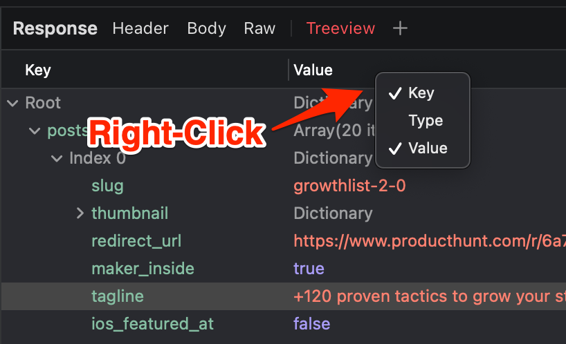
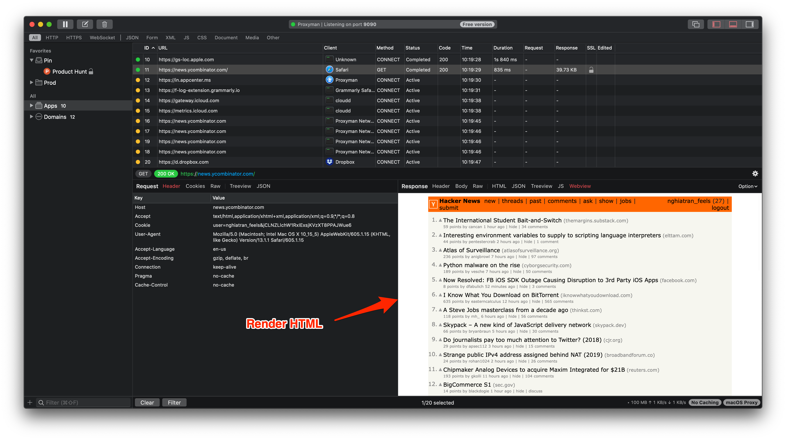

# Custom Previewer Tab

## 1. What's it?

You can customize the Custom Previewer Tabs, which always render one format at once time.

This handy tool might help you to fix the following issues:

* Format the BODY as **JSON**, but the Content-Type isn't `application/json`
* Format the body as **Protobuf**, but the Content-Type isn't `application/x-protobuf`
* Render HTML Page on the Web View
* **Beautify** the minified files (HTML, CSS, JS)
* Multipart/form-data
* Try to format the body as the selected type regardless of the `Content-Type`
* Convert MessagePack (msgpack) to JSON
* [Code Generator](../advanced-features/code-generator.md) to Swift, Node, Javascript, cURL, ...
* GraphQL Query Prettier

<figure><figcaption>
Select Custom Tabs for Request / Response Panel
</figcaption></figure>


The selected custom tabs will be appended to the right side of the Request or Response view&#x20;


<figure><figcaption>
Display Custom Tabs
</figcaption></figure>

## 2. How to use it?

You can either access the Custom Previewer Window:

1. Click on the "+" button on the Request/Response bar or (from the Tools Menu -> Custom Previewer Tab...)
2. Click the checkbox to show/hide your custom Tab
3. The New Tab will appear on the Request or Response Panel ✅

### 2.1 Server-Sent Events and OpenAI Tabs

From Proxyman 5.22.0 or later, Proxyman supports

* Server-Sent Events from OpenAI endpoints: Auto prettify the inline JSON of the data event
* OpenAI Tab: Auto accumulate the content and show the final result, similar to the output of your chat view.

<figure><figcaption>
Capture OpenAI Endpoints
</figcaption></figure>

## 3. ⚡️ Advance: Create a custom Tab with the Scripting Tool

* ✅ Show your own data on your tab
* It is useful if you want to decode your Body or display a partial body to your custom tab

### How to use:

1. the Click on the "+" button on the Request/Response bar or (from the Tools Menu -> Custom Previewer Tab...)
2. Select the \`Add Custom Tab\` button
3. Select the Request / Response panel and set a name for your tab

<figure><figcaption></figcaption></figure>

4. Click on the "..." button to show the Javascript Code

<figure><figcaption>
Show the Javascript Code
</figcaption></figure>

5. Tools -> Scripting -> Add new Rule -> Use this code to display your own data

<figure><figcaption>
Write your code to display data
</figcaption></figure>

6. Done

<figure><figcaption>
Display your data on a new tab
</figcaption></figure>

## 4. Examples

#### Force render JSON TreeView

Proxyman supports JSON Tree View for better visualization

We can show/hide a certain column by Right-Click on the Column Header

#### Force render HTML Page

#### Beautify the Javascript files

