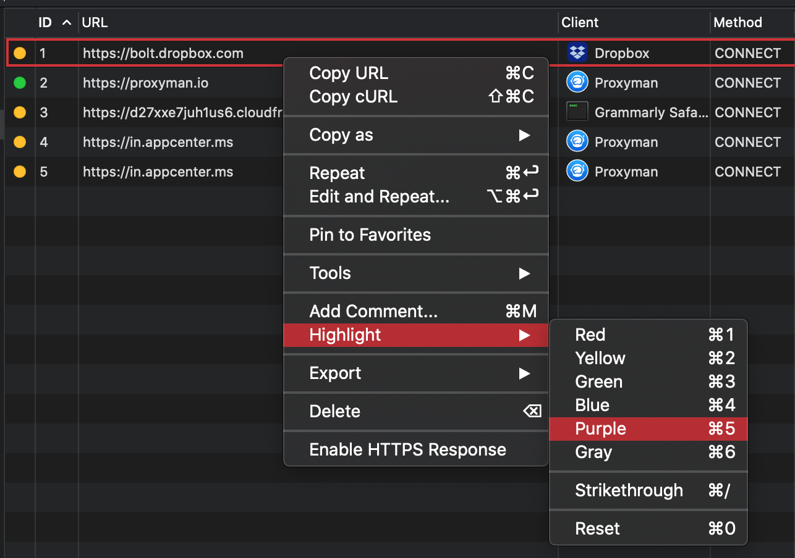

# Highlight by Color and Add Comment

## 1. What's it?

You can

* **Highlight** a single or group of Request with pre-defined **colors** (Red, Yellow, Green, Blue, Purple, Gray)
* Add ~~Strikethrough~~
* Add Comment
* Filter by Color or Comment (CMD+F)
* Export with Color and Comment (Only Support Proxyma Log format)

## 2. Benefit?

* Easily mark your failed, succeed request/response with eye-catching colors&#x20;
* Add Comments during development.&#x20;
* Share it with your colleague (Color and Comment)
* Easily filter out the request/response by Color or Commend

3\. Shortcuts?

Proxyman supports many shortcuts to help you highlight or add comments quickly.

| Shotcut | Purpose                          |
| ------- | -------------------------------- |
| ⌘1      | Highlight with Red Color         |
| ⌘2      | Highlight with Yellow Color      |
| ⌘3      | Highlight with Green Color       |
| ⌘4      | Highlight with Blue Color        |
| ⌘5      | Highlight with Purple Color      |
| ⌘6      | Highlight with Gray Color        |
| ⌘0      | Reset All                        |
| ⌘/      | Add Strikethrough style          |
| ⌘M      | Add Comment to selected requests |

