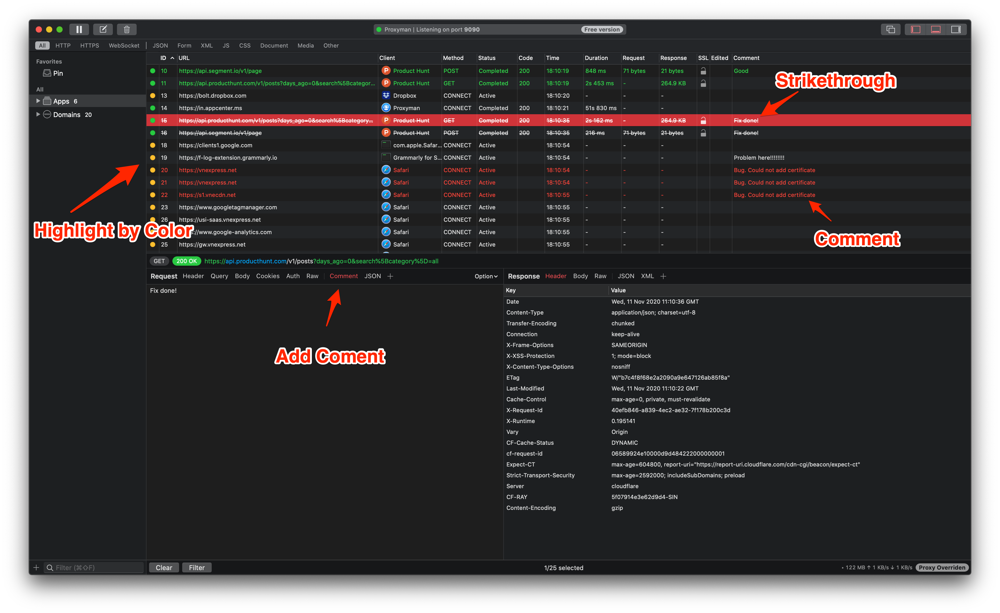

# Highlight by Color and Add Comment

## 1. What's it?

You can

* **Highlight** a single or group of Request with pre-defined **colors** (Red, Yellow, Green, Blue, Purple, Gray)
* Add ~~Strikethrough~~
* Add Comment
* Filter by Color or Comment (CMD+F)
* Export with Color and Comment (Only Support Proxyma Log format)

## 2. Benefit?

* Easily mark your failed, succeed request/response with eye-catching colors
* Add Comments during development.
* Share it with your colleague (Color and Comment)
* Easily filter out the request/response by Color or Commend

## 3. How to use

1. Right click on the Request
2. Highlight -> Colors

<figure><figcaption></figcaption></figure>
