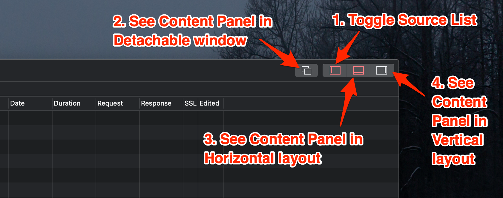

# Horizontal/Vertical/Window Layout

To compare two traffic lists in the same tab, use [Split View](split-view.md). To organize traffic across tabs, use [Tab View](multiple-tabs.md). The controls below change the Request and Response inspector layout.

It's possible to change the UI layout of the Request and Response Panels to optimize your space to render the content.

* **Detachable Window**: Bring Request and Response to a seperated Windows
* **Vertical**: Request and Response Panel is in Vertical Mode
* **Horizontal**: Request and Response Panel is in Horizontal Mode

| Shortcut             | Description       |
| -------------------- | ----------------- |
| ⇧**⌘ + Up Arrow**    | Detachable Window |
| ⇧**⌘ + Left Arrow**  | Toggle Left Panel |
| ⇧**⌘ + Right Arrow** | Vertical Mode     |
| ⇧**⌘ + Down Arrow**  | Horizontal Mode   |
