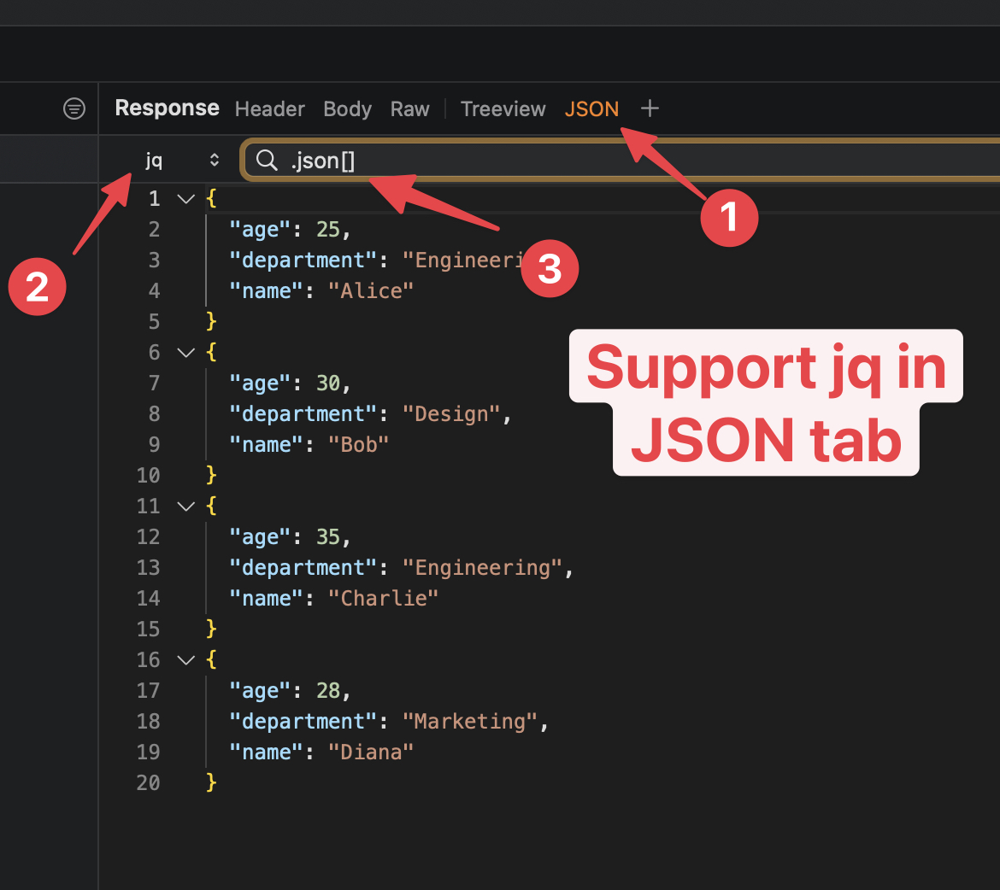

# JQ

## 1. What's it?

* jq is like sed for JSON data - you can use it to slice and filter and map and transform structured data with the same ease that sed, awk, grep and friends let you play with text.
* Available on Proxyman 5.24.0 or later


- jq Filter is only available in the JSON Tab. On the Request/Response Tool bar -> Click on the + button -> Select JSON in the Request or Response. A new JSON Tab will be added.


<figure><figcaption></figcaption></figure>

## 2. Syntax

* Please refer the [jq Manual Page](https://jqlang.org/manual/#basic-filters) to understand how to use the jq
