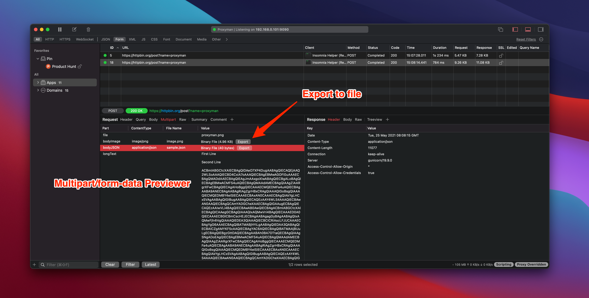

# Multipart Form-Data Previewer

## 1. What's it?

From Proxyman 2.27.0+, Proxyman displays a multipart/form-data in a nice table view.

### 2. Benefit

* Display each separate part of the multipart/form-data body
* Able to export the data
