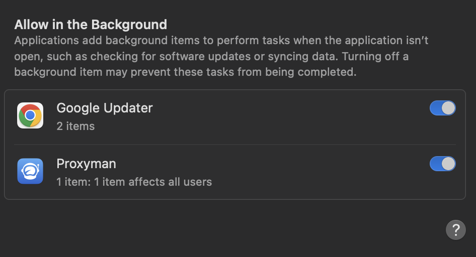

# Proxyman Proxy Helper Tool

## Proxyman Proxy Helper Tool

By default, Proxyman will try overriding your HTTP/HTTPS Proxy Config by using the [networksetup](https://www.unix.com/man-page/osx/8/networksetup/) Command-Line. However, the **networksetup** is a bottleneck during starting or quitting the app.&#x20;

Proxyman offers a better solution: **Proxyman Proxy Helper Tool**, which is a [Privileged Helper Tool macOS](https://developer.apple.com/library/archive/documentation/Security/Conceptual/SecureCodingGuide/Articles/AccessControl.html#//apple\_ref/doc/uid/TP40002589-SW2) in order to override Network Proxy in **high performance**.[ ](https://developer.apple.com/library/archive/documentation/Security/Conceptual/SecureCodingGuide/Articles/AccessControl.html#//apple\_ref/doc/uid/TP40002589-SW2)


You can notice the performance difference by starting the app with or without the Proxy Setting Tool.


At the first launch, Proxyman will present the Popup to install the Proxyman Proxy Helper Tool. You can skip it and install it later in **Preference** -> **Advanced** Tab.

<figure><figcaption></figcaption></figure>


After the installation, you can find the Helper tool at `/Library/PrivilegedHelperTools/com.proxyman.NSProxy.HelperTool`

If Proxyman releases a new update for Proxy Setting Helper Tool, it requires installation again.


### Require user Permission for macOS 13 Ventura or later

MacOS Ventura or later requires permission to work properly.

To grant the permission, please follow the steps:

1. Open System Setting -> General -> Login Items
2. Find Proxyman and Switch ON ✅

<figure><figcaption><p>Grant permission to Proxyman Helper Tool</p></figcaption></figure>

### Guest or non-admin users

If you're a guest or non-admin user, the `networksetup` CLI would fail and could not change the HTTP/HTTPS Proxy config until you install the Proxyman Proxy Helper Tool.&#x20;

Proxyman Proxy Helper Tool has privileged permission to override the proxy config for all kinds of users.

We highly recommend installing the Proxyman Helper Tool if you're a guest or non-admin user to make the UX smoother.

### Uninstall the Proxy Helper Tool

You can uninstall the Proxy Helper Tool in **Preference** -> **Advanced** Tab -> **Uninstall** Proxy Setting Tool or delete it directly at `/Library/PrivilegedHelperTools/com.proxyman.NSProxy.HelperTool`

## Install the Proxy Helper Tool by command line

From macOS 4.12.0 or later, you can install the Helper Tool without GUI.

```
sudo /Applications/Proxyman.app/Contents/MacOS/proxyman --install-privileged-components
```

## Changelog

#### **Version 1.5.0**

* Fix the Security Vulnerability that Proxyman v1.5.0 or older (2019) can connect to the Helper Tool (v1.4.0) and override the system proxy without user consent. This fix will add some constraints to verify the incoming Connection. (The caller must be notarized by Apple, signed by Proxyman LLC Certificate, enabled Library Validation, and enabled Force Hard flag). (CVE-2023-45732)

📣 Credit to **Scott Leitch** from NCC Group.

#### **Version 1.4.0**

* Comply with new macOS 13 Ventura Requirements for Helper Tool
* Show App Icon & App Name on the Login-Items

<figure><figcaption><p>Display correct Proxyman icon and App Name</p></figcaption></figure>


On macOS Ventura, Helper Tools, Launch Daemon, and Launch Agent will be added to the Allow in the Background, even though Proxyman only runs on the Foreground.

There is an ongoing discussion on [Twitter](https://twitter.com/siracusa/status/1583914093437935616?s=46\&t=C1XB91IkDFkG697Ab8T9Dg) that macOS should fix it.


After installing the 1.4.0, the Login Item might not be updated due to the cache layer of the Preference.&#x20;

<figure><figcaption><p>Invalid Cache</p></figcaption></figure>

To fix it:

1. Open Terminal app -> Run: `sfltool resetbtm`
2. Restart the macOS
3. Done

#### **Version 1.3.0**

* Remember and restore to your previous Proxy Setting.

#### Version 1.2.0:&#x20;

* Gracefully revert the HTTP Proxy Config if Proxyman is crashed.

### Troubleshooting

If you've encountered this error when installing the helper Tool:

The operation couldn’t be completed. (CFErrorDomainLaunchd error 9.)

Please follow this solution: [https://cloud.tencent.com/developer/article/1816504](https://cloud.tencent.com/developer/article/1816504)

Ref: [https://github.com/ProxymanApp/Proxyman/issues/1113](https://github.com/ProxymanApp/Proxyman/issues/1113)

