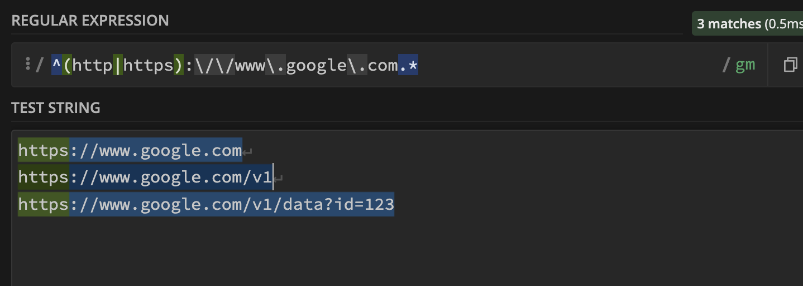

# Regex (Regular Expression)

## 1. What's it?

From the 2.3.0 version, Proxyman supports **Wildcard** and **Regex** (Match a whole word) when you define matching rules for all available tools:

* Map Local
* Map Remote
* Block & Allow List
* Breakpoints
* Protocol Buffers (Protobuf)
* Reverse Proxy
* Network Throttling
* ...

It's a handy tool to help you exactly define which requests should trigger the tool.

## 2. Test your URL (New feature 🎉)

From Proxyman v4.8.0, you can quickly test your Rule (Wildcard / Regex).

* You can quickly test & play around with your Wildcard/Regex
* **Save time**: You don't need to go back and forth to check your URL.
* Less error-prone.

<figure><figcaption></figcaption></figure>

#### How to use it?

1. Open any debugging tools (Breakpoint, Map Local, ...) -> Create a new rule
2. Click on the "Test your Rule" underline button -> New Window is opened.
3. Add your Rule and URLs you'd like to check

* :white\_check\_mark: Matched: Your URL is matched with your rule.
* :warning: Not Matched: Your URL doesn't match your rule. You might rewrite your wildcard/Regex rule.

## 3. Wildcard

Proxyman supports simple Wildcard characters, which include `*` and `?`

| Wildcard | Purpose                                                              |
| -------- | -------------------------------------------------------------------- |
| `*`      | The asterisk in a wildcard matches any character zero or more times. |
| `?`      | A question mark matches a single character once.                     |

For instance:

* http://proxyman.io/v1/\*
* https://myserver.com/v?/\*

## 4. Regex

Proxyman also supports Regex.&#x20;

* Make sure your regex is **matching a whole URL**.
* **Partial Matching** is considered as not matching.
* Make sure you **escape characters** properly: Splash (/), full-stop (.), etc.

For instance:

| Regex                                                                        | Matched URL Examples                                                                             |
| ---------------------------------------------------------------------------- | ------------------------------------------------------------------------------------------------ |
| https:\\/\\/proxyman\\.io.\*                                                 | 
https://proxyman.io https://proxyman.io/v1/data?id=123 https://proxyman.io/pricing
  |
| ^(http\|https):\\/\\/www\\.google\\.com.\*                                   | 
http://www.google.com http://www.google.com/user?id=proxyman https://www.google.com
 |
| ^(http\|https)?:\\/\\/www\\.google\\.com\\/v\[0-9]?\\/build\\?query=proxyman | 
http://www.google.com/v1/build?query=proxyman www.google.com/v2/build?query=proxyman
   |

You can use [https://regex101.com/](https://regex101.com/) to verify your Regex that matches the whole text.


Please check the [**Regex** **Metacharacters, Operator and Flag**](https://developer.apple.com/documentation/foundation/nsregularexpression#1965590) from Apple Developer Documents to know which one is supported.



Check [https://regex101.com](https://regex101.com) and make sure your Regex is full-matching with the given URL


* Select Regex when creating rules


With regular expressions the meaning of `?` and `*` is different from that of wildcards. The equivalent of wildcard `?` is the regex `.` and the equivalent of wildcard `*` is the regex `.*`

