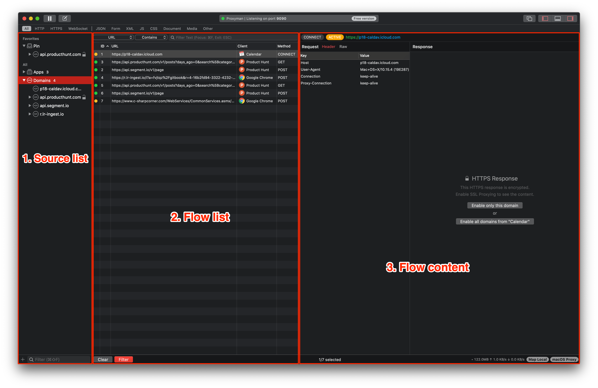
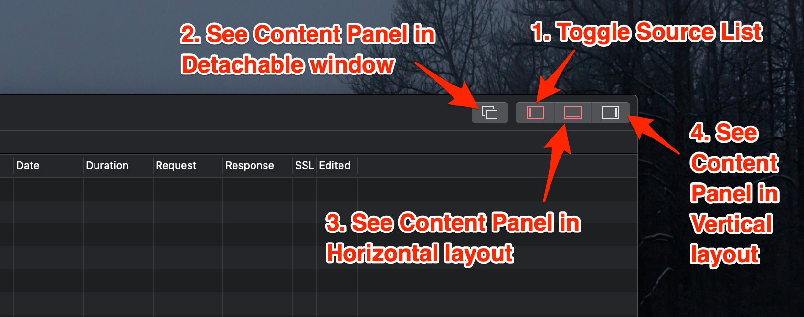

# Request / Response Previewer

After installing the [Certificate](../debug-devices/macos.md) and enable [HTTP Response](ssl-proxying.md) on domains or clients, your network traffic would show up immediately inside the Proxyman window, separated into three main areas:

* The Source List on the left panel&#x20;
* The Flow List on the middle panel&#x20;
* The Flow Content on the right panel

### Body Content Previewer

Depend on what the content of the Request or Response is: Proxyman will automatically show in separate tabs:

* **Header**: All headers (key-value table)
* **Cookies**: **Cookie** key in the header
* **Set-Cookie** for the Set-Cookie Header in the Response
* **Auth**: **Authentication** key in the header
* **Body**: The body of the message: Proxyman automatically formats and beautifies the body content depends on the **Content-Type,** such as JSON, PNG, GIF, Raw Data, ...
* **Query**: If the request has a query, all queries are presented.
* **Raw**: The RAW HTTP message.
* Protobuf Message
* MessagePack
* Multipart/form-data

### Custom Previewer Tab

It's possible to customize which Previewer Tab you would like to see

* Custom tabs will persistent on the Request/Response Panel
* Attempt to decode and beautify the content


[custom-previewer-tab.md](custom-previewer-tab.md)


### Layout mode

There are two way to order the Request / Response Panel: Vertical or Horizontal layout

### Customize Workspace

You can use custom layout buttons on the top right corner of the app to display content as your preference

1. Collapse/Expand Source List Panel&#x20;
2. Open Request/ Response Panel in new window
3. Display Request/Response Panel in Horizontal layout
4. Display Request/Response Panel in Vertical layout

### Shortcuts

All sections are support **Copy (⌘C)** and multiple selections

Read more at our [Proxyman Keyboard Shortcuts](https://proxyman.io/blog/2019/08/Proxyman-keyboard-shortcuts.html) blog

### **Body Previewer**&#x20;

Body previewer automatically beautifies the content as well as offering handy minor features:

* **Tree View**: Represent the JSON in Tree View mode
* **Hex**: Show the body in Hex format
* **Export only body**: Able to export your body content to file. Suitable for Raw Data or binary data
* **Open With**: You can open the Body content with your favorite Editor. **Sublime Text** is mime 😍

### JSON Tree View mode

Proxyman supports native JSON Tree View mode, which displays a JSON Body. It allows the developer to:

* Search JSON by [JSON Path](jsonpaths.md)
* Copy JSON Node like Google Developer Tool does.

