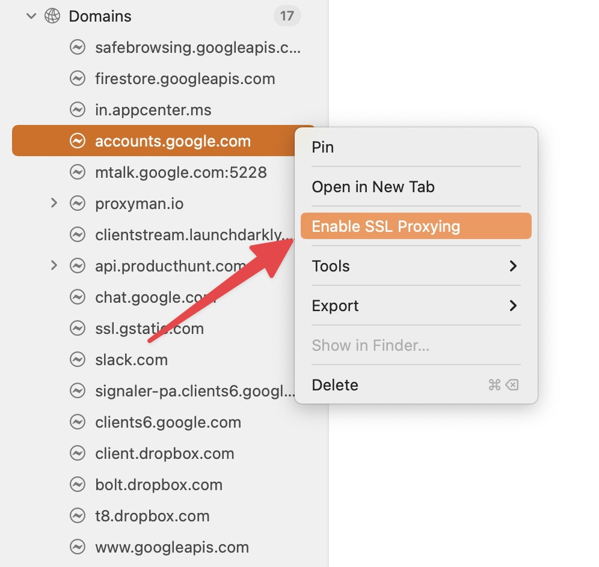
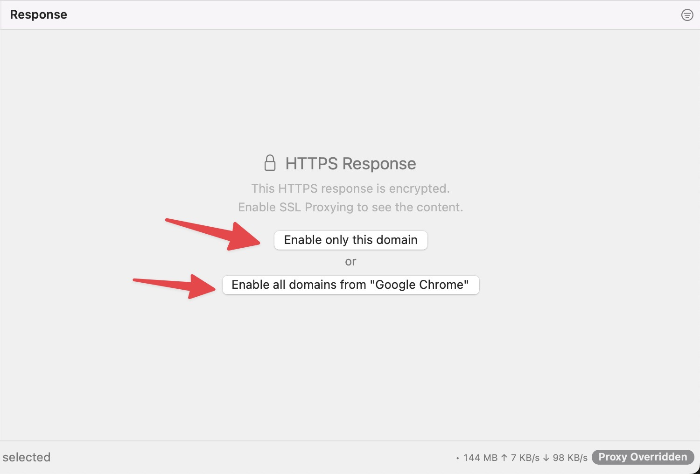

# SSL Proxying

## 1. SSL Proxying List

A list of domains or applications that Proxyman should decrypt its SSL Connection. It enables the user to inspect the HTTPS Request/Response in plain text.

### Include List and Exclude List

You can define rules for:

* **Include List**: Intercept the traffic from apps/domains if it's in the include list
* **Exclude List**: Ignore all traffic from apps/domains in Exclude List


⌘⌥P to quickly open the SSL Proxying List.


### Apps / Domains / Wildcards

Proxyman supports several formats to define a rule:

* **By app**: Intercept all traffic that goes from this app
* **By Domain**: Intercept all traffic from this domain
* **Wildcard**: If it's matched the wildcard regex

For examplee:

| Wildcard                    | Description                                                |
| --------------------------- | ---------------------------------------------------------- |
| \*                          | Decrypt ALL HTTPS traffic                                  |
| \*.domain.com, \*.apple.com | e.g. v1.domain.com, data.domain.com, health.apple.com, ... |
| v?.domain.com               | e.g. v1.domain.com, v2.domain.com, ...                     |


It's essential to set up the Proxyman Certificate before intercepting any HTTPS requests. You can follow the [macOS setup Guide](../debug-devices/macos.md) to properly install and trust the certificate..


### How to enable SSL Proxying on a particular domain or app

* Right-Click on the app or domain on the Left Panel -> Enable SSL Proxying

<figure><figcaption>
Add a domain to the SSL Proxying List
</figcaption></figure>

* Right-Click on the Request on the main table -> Enable SSL Proxying
* Select the request and enable SSL Proxying on the Response Panel.

<figure><figcaption>
Enable entire app or a single domain
</figcaption></figure>
