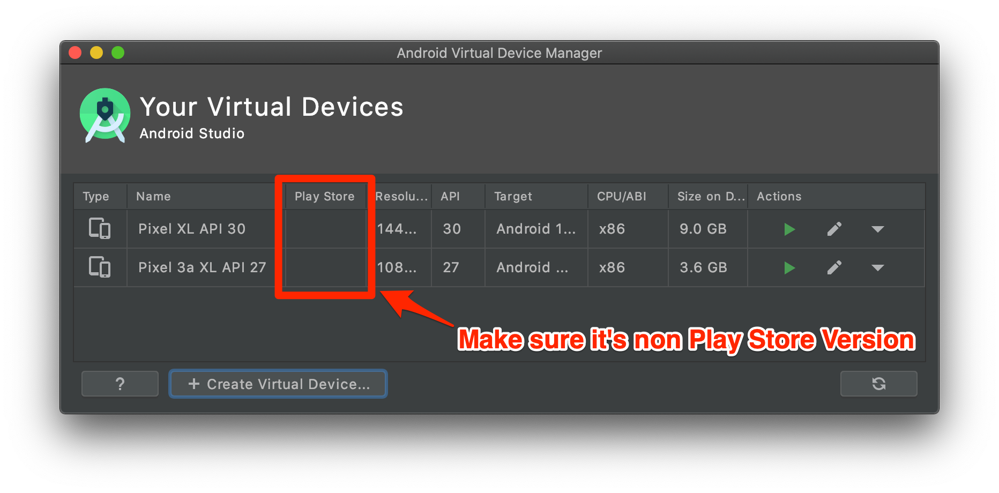

# Automatic Script for Android Emulator

## 1. What's it?

It's too complicated and error-prone if we manually override the HTTP Proxy, Install, and Trust Proxyman Certificate from your Android Emulator.&#x20;

Thus, Proxyman provides a built-in script to automatically perform it in a second. You can access it from **Certificate Menu -> Install Certificate on Android -> Emulator.**


From Proxyman 5.14.0 or earlier, this Script only installs the User Certificate to the User Certificate Store, not the System Certificate Store. If you'd like to install the certificate to the System Certificate, please follow this [tutorial](https://docs.mitmproxy.org/stable/howto-install-system-trusted-ca-android/).



From Proxyman 5.15.0 or later, Proxyman can now install Proxyman certificate into the system-level Store. Make it possible to decrypt all HTTPS from Android Emulators.


## 2. Benefit?

**1 Click to:**

* **✅ Auto** Override / Revert HTTP Proxy
* **✅ Automatically** Download, Install, and Trust Proxyman Certificate to system-level store. Can decrypt all HTTPS from your Emulators.
* No need **network\_security\_config.xml**
* **✅** Less error-prone and finishes in a few clicks

<div data-full-width="true"><figure><figcaption><p>Capture and decrypt HTTPS from Android Emulators with Proxyman</p></figcaption></figure></div>

* Install Proxyman Certificate to the system-level Store.

<figure><figcaption><p>Install Proxyman Certificate to the system-level Store.</p></figcaption></figure>


## 3. How to use it?

1. Make sure the adb command is installed. If not, please install it

```bash
brew install android-platform-tools
```

2. Open your Android app with Android Studio
3. Create a new Emulator in Android Virtual Device Manager. **Make sure it's not a Play Store. Must be a Google Play APIs**




3. Open Proxyman -> Certificate Menu -> Install Certificate on Android -> Emulators -> Click on the Override All Emulators button&#x20;

<figure><figcaption><p>capture all HTTPS from Emulators with 1 click</p></figcaption></figure>

4. Wait until the Terminal completes

<figure><figcaption></figcaption></figure>

5. Relaunch your Android app on Android Studio&#x20;
6. Proxyman will capture all HTTPS data ✅


If you close Proxyman, make sure to click on the Revert All Changes button. Otherwise, your Android Emulator could not access the Internet.


## 4. Advance: Run the script manually

It's possible to execute the script manually in your Terminal app without granting the Automation Permission in Security & Privacy.

### **Script path**:&#x20;


```bash
/Applications/Proxyman.app/Contents/Frameworks/ProxymanCore.framework/Resources/install_certificate_android_emulator.sh
```


### Prepare the certificate

1. Open Proxyman app
2. Find the current IP in the Main Toolbar
3. Certificate menu -> Export -> Root Certificate as PEM -> Save to Desktop folder

### 4.1 Override HTTP Proxy and Install the Certificate to system-level Store


```bash
bash /Applications/Proxyman.app/Contents/Frameworks/ProxymanCore.framework/Resources/install_certificate_android_emulator.sh all <current_ip> <port> <certificate_path>
```


Example:


```bash
bash /Applications/Proxyman.app/Contents/Frameworks/ProxymanCore.framework/Resources/install_certificate_android_emulator.sh all 192.168.1.1 9090 ~/desktop/proxyman-ca.pem
```


### 4.2 Only Override HTTP Proxy&#x20;


```bash
bash /Applications/Proxyman.app/Contents/Frameworks/ProxymanCore.framework/Resources/install_certificate_android_emulator.sh proxy <current_ip> <port> 
```


Example:


```bash
bash /Applications/Proxyman.app/Contents/Frameworks/ProxymanCore.framework/Resources/install_certificate_android_emulator.sh proxy 192.168.1.1 9090 
```


### 4.3 Revert HTTP Proxy&#x20;


```bash
bash /Applications/Proxyman.app/Contents/Frameworks/ProxymanCore.framework/Resources/install_certificate_android_emulator.sh revertProxy
```

