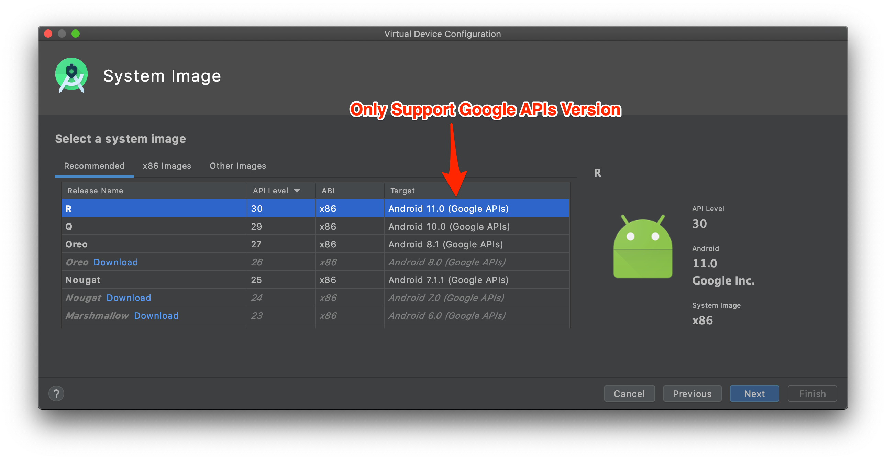

# Automatic Script for Android Emulator

## 1. What's it?

It's too complicated and error-prone if we manually override the HTTP Proxy, Install, and Trust Proxyman Certificate from your Android Emulator.&#x20;

Thus, Proxyman provides a built-in script to automatically perform it in a second. You can access it from **Certificate Menu -> Install Certificate on Android -> Emulator.**


From Proxyman 5.14.0 or earlier, this Script only installs the User Certificate to the User Certificate Store, not the System Certificate Store. If you'd like to install the certificate into the System Certificate, please follow this [tutorial](https://docs.mitmproxy.org/stable/howto-install-system-trusted-ca-android/).



From Proxyman 5.15.0 or later, Proxyman can now install Proxyman certificate into the system-level Store. Make it possible to decrypt all HTTPS from Android Emulators.


<figure><figcaption></figcaption></figure>

## 2. Benefit?

**1 Click to:**

* **✅ Auto** Override / Revert HTTP Proxy
* **✅ Automatically** download, install, and trust the Proxyman Certificate at the system-level store. Can decrypt all HTTPS from your Emulators. (Available on Proxyman 5.16.0 or later)
* No need **network\_security\_config.xml**
* **✅** Less error-prone and finishes in a few clicks


Work with Android Emulator and Android Physical Devices via \`adb\`  (Only for Proxyman v5.19.0+)


<div data-full-width="true"><figure><figcaption><p>Capture and decrypt HTTPS from Android Emulators with Proxyman</p></figcaption></figure></div>

* Install Proxyman Certificate to the system-level Store.

<figure><figcaption><p>Install Proxyman Certificate to the system-level Store.</p></figcaption></figure>


### ✅ Flutter / React Native app

From Proxyman macOS 6.4.0 or later, Proxyman can capture HTTPS traffic from the Flutter app without a code change required.

Refer [flutter.md](../flutter.md "mention") documentation to know more.

## 3. How to use it?

1. Make sure the adb command is installed. If not, please install it

```bash
brew install android-platform-tools
```

2. Open your Android app with Android Studio
3. Create a new Emulator in Android Virtual Device Manager. **Make sure it's not the Play Store. Must be a Google Play API**




<figure><figcaption></figcaption></figure>

3. Open Proxyman -> Certificate Menu -> Install Certificate on Android -> Emulators -> Click on the Override All Emulators button&#x20;

<figure><figcaption><p>capture all HTTPS from Emulators with 1 click</p></figcaption></figure>

4. Wait until the Terminal completes

<figure><figcaption></figcaption></figure>

5. Relaunch your Android app on Android Studio&#x20;
6. Proxyman will capture all HTTPS data ✅


If you close Proxyman, make sure to click on the Revert All Changes button. Otherwise, your Android Emulator could not access the Internet.


## 4. ⚠️ Proxyman 5.15.0 or earlier&#x20;

* Proxyman 5.15.0 or earlier is only able to install Proxyman Certificate to the User level.
* It means: We have to complete the next step:
* In your source code:
  * Add res/xml/network\_security\_config.xml

```xml
<network-security-config>
    <debug-overrides>
        <trust-anchors>
            <!-- Trust user added CAs while debuggable only -->
            <certificates src="user" />
            <certificates src="system" />
        </trust-anchors>
    </debug-overrides>

    <base-config cleartextTrafficPermitted="true">
        <trust-anchors>
            <certificates src="system" />
            <certificates src="user" />
        </trust-anchors>
    </base-config>
</network-security-config>
```

* Add to AndroidManifest.xml

<pre class="language-xml"><code class="lang-xml">&#x3C;?xml version="1.0" encoding="utf-8"?>
&#x3C;manifest xmlns:android="http://schemas.android.com/apk/res/android"
    xmlns:tools="http://schemas.android.com/tools">

    &#x3C;uses-permission android:name="android.permission.INTERNET" />

    &#x3C;application
        <a data-footnote-ref href="#user-content-fn-1">android:networkSecurityConfig="@xml/network_security_config"></a>
        &#x3C;activity
            ...
        &#x3C;/activity>
    &#x3C;/application>

&#x3C;/manifest>
</code></pre>

## 5. Advance: Run the script manually

It's possible to execute the script manually in your Terminal app without granting the Automation Permission in Security & Privacy.

### **Script path**:&#x20;


```bash
/Applications/Proxyman.app/Contents/Frameworks/ProxymanCore.framework/Resources/install_certificate_android_emulator.sh
```


* For Proxyman 51.9.0 or later


```bash
Usage: /Applications/Proxyman.app/Contents/Frameworks/ProxymanCore.framework/Resources/install_certificate_android_emulator.sh -m <mode> [options]

Modes:
  all             Set proxy and install certificate
  proxy           Set proxy only
  revertProxy     Revert proxy settings only
  certificate     Install certificate only

Required Options based on Mode:
  -m, --mode <mode>              : Operation mode (all, proxy, revertProxy, certificate)
  -i, --ip <ip_address>          : IP address (required for all, proxy, certificate)
  -p, --port <port_number>       : Port number (required for all, proxy, certificate)
  -c, --cert <path_to_cert.pem>  : Path to Proxyman certificate (required for all, certificate)

Optional Options:
  --include-physical            : Include physical devices (default: only emulators)
  -h, --help                    : Show this help message
```


### Prepare the certificate

1. Open the Proxyman app
2. Find the current IP in the Main Toolbar
3. Certificate menu -> Export -> Root Certificate as PEM -> Save to Desktop folder

### 4.1 Override HTTP Proxy and Install the Certificate to system-level Store

* Proxyman v5.19.0 or later (NEW)


```bash
bash /Applications/Proxyman.app/Contents/Frameworks/ProxymanCore.framework/Resources/install_certificate_android_emulator.sh --mode all --ip <current_ip> --port <port> --cert <certificate_path>
```


* Proxyman v5.18.0 or earlier&#x20;


```bash
bash /Applications/Proxyman.app/Contents/Frameworks/ProxymanCore.framework/Resources/install_certificate_android_emulator.sh all <current_ip> <port> <certificate_path>
```


### 4.2 Only Override HTTP Proxy&#x20;

* Proxyman v5.19.0 or later (NEW)


```bash
bash /Applications/Proxyman.app/Contents/Frameworks/ProxymanCore.framework/Resources/install_certificate_android_emulator.sh --mode proxy --ip <current_ip> --port <port>
```


* Proxyman v5.18.0 or earlier&#x20;


```bash
bash /Applications/Proxyman.app/Contents/Frameworks/ProxymanCore.framework/Resources/install_certificate_android_emulator.sh proxy <current_ip> <port> 
```


### 4.3 Revert HTTP Proxy&#x20;

* Proxyman v5.19.0 or later (NEW)


```bash
bash /Applications/Proxyman.app/Contents/Frameworks/ProxymanCore.framework/Resources/install_certificate_android_emulator.sh --mode revertProxy
```


* Proxyman v5.18.0 or earlier&#x20;


```bash
bash /Applications/Proxyman.app/Contents/Frameworks/ProxymanCore.framework/Resources/install_certificate_android_emulator.sh revertProxy
```


[^1]: This line
