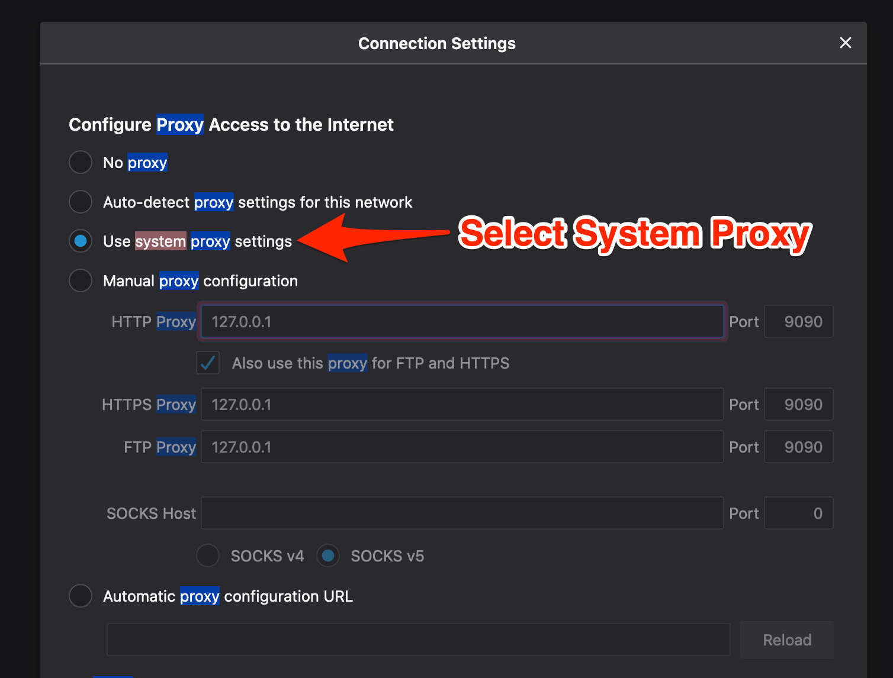
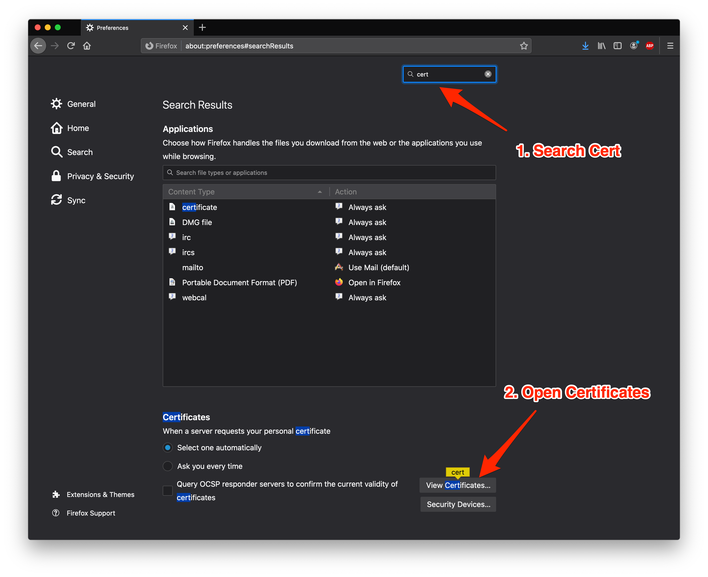
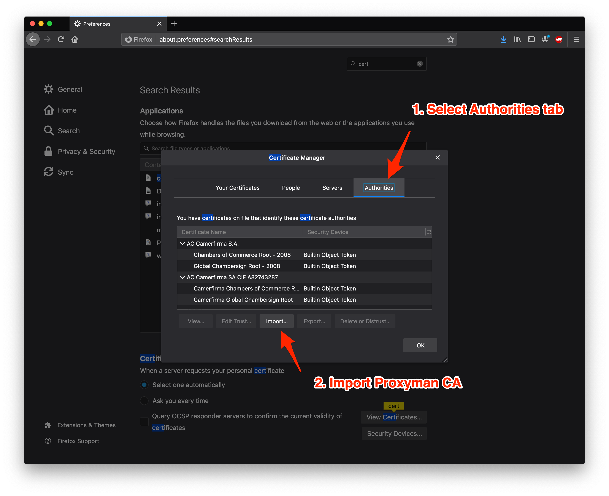
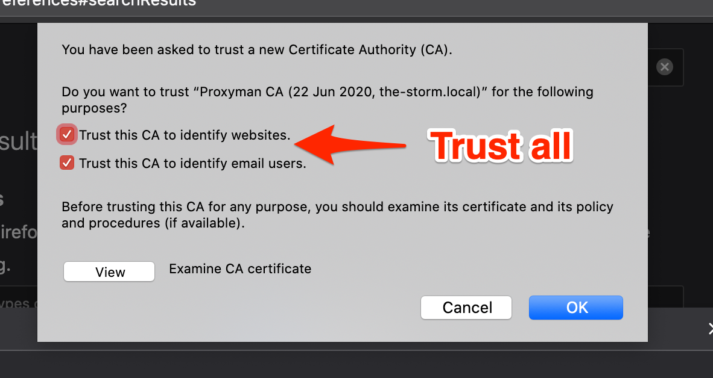

# Firefox

## ✅ New Solution (Proxyman v5.19.0 or later - recommended)

With Proxyman v5.19.0+, Proxyman can capture HTTPS Requests/Responses from Firefox with 1-click setup.

1. Go to Setup Menu -> Automatic Setup
2. On the Web Browser Section -> Click the ⬇️ Arrow Button -> Select Firefox

<figure><figcaption>
How to capture HTTPS Reqyests/Responses from Firefox Browser with Proxyman
</figcaption></figure>

3. New Firefox instance will open
4. ✅ Done. All traffic from Firefox will be captured by Proxyman

This setup will make Firefox or Google Chrome:

* Auto set Proxyman to Proxyman
* Auto install & trust Proxyman Certificate


Works with Google Chrome and Firefox


## ❌ Old Solution (Proxyman v5.18.0 or ealier)

In order to intercept HTTPS traffic from Firefox, it requires extra steps to install Proxyman CA into Firefox's Trust Store.

### 1. Install Proxyman CA on macOS machine

Before installing Proxyman CA on Java VMs, we have to install it properly on your current machine.

Check out macOS Guidelines:


[macos.md](macos.md)


If you've done this step, you can skip to the next step.

### 2. Set Proxy on Firefox

* Open Firefox's Preferences panel (CMD+,)
* Search Proxy and open the Proxy Settings
* Select Auto Use System Proxy or manually hardcode the Proxy IP and Port

### 3. Install Proxyman CA to Firefox

1. Open `http://proxy.man/ssl` on Firefox and download the certificate to your Download folder


http://proxy.man/ssl is a local HTTP Server for strengthening the security. Please make sure the Proxyman app is open when accessing this domain.


2\. Open Firefox's Preferences (CMD+,) and openthe  View Certificate window

3\. Open the Authorities Tab and select the Import button

4\. Select Proxyman CA, which you've downloaded and Trust all.

5\. Reload the page that you need to intercept. Enjoy!
