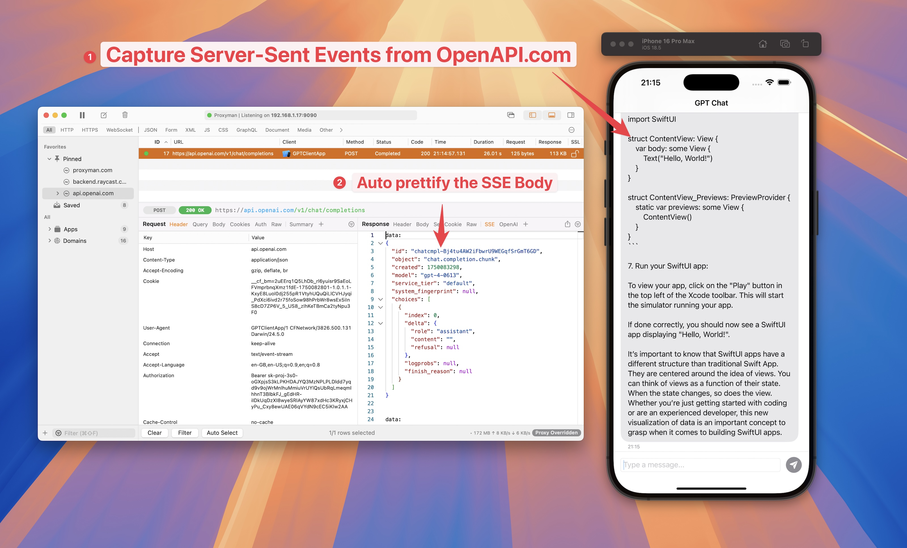

# Flutter

Currently, [Flutter does not use the system-level proxy](https://github.com/flutter/flutter/issues/20376), so if you use Proxyman, you might not see any traffic from your Flutter Project.

The good news is that you can work around this issue by manually configuring Flutter’s HTTP client to use Proxyman as its proxy.&#x20;

In general, we have to manually config the HTTP Client to proxy all traffic to Proxyman Proxy Server, which is listening at IP = localhost, port = 9090.

## 1. Setup Flutter (Required to all platforms - iOS & Android)

Depending on which HTTP client you’re using, the steps will be slightly different. We will cover some popular HTTP Clients:

* Dart’s [HttpClient](https://api.dartlang.org/stable/2.4.1/dart-io/HttpClient-class.html) class
* The [http](https://pub.dev/packages/http) package
* [Dio](https://pub.dev/packages/dio)

If you're using Android Emulator or iOS Simulator, you can use `String proxy = 'localhost:9090'`. Otherwise, please use `String proxy = '<YOUR_LOCAL_IP>:9090'` on Android Physical Devices.

You can find the \<YOUR\_LOCAL\_IP> from the Proxyman -> Certificate menu -> Install for iOS -> Physical Device

<figure><figcaption><p>Use current IP</p></figcaption></figure>

### 1.1 Dart HTTPClient Class

```java
// Make sure to replace <YOUR_LOCAL_IP> with 
// the external IP of your computer if you're using Android. 
// You can get the IP in the Android Setup Guide window
String proxy = Platform.isAndroid ? '<YOUR_LOCAL_IP>:9090' : 'localhost:9090';

// Create a new HttpClient instance.
HttpClient httpClient = new HttpClient();

// Hook into the findProxy callback to set
// the client's proxy.
httpClient.findProxy = (uri) {
  return "PROXY $proxy;";
};

// This is a workaround to allow Proxyman to receive
// SSL payloads when your app is running on Android
httpClient.badCertificateCallback = 
  ((X509Certificate cert, String host, int port) => true);
```

### 1.2 HTTP Package

```java
// Make sure to replace <YOUR_LOCAL_IP> with 
// the external IP of your computer if you're using Android. 
// You can get the IP in the Android Setup Guide window
String proxy = Platform.isAndroid ? '<YOUR_LOCAL_IP>:9090' : 'localhost:9090';

// Create a new HttpClient instance.
HttpClient httpClient = new HttpClient();

// Hook into the findProxy callback to set
// the client's proxy.
httpClient.findProxy = (uri) {
  return "PROXY $proxy;";
};

// This is a workaround to allow Proxyman to receive
// SSL payloads when your app is running on Android.
httpClient.badCertificateCallback = 
  ((X509Certificate cert, String host, int port) => true);

// Pass your newly instantiated HttpClient to http.IOClient.
IOClient myClient = IOClient(httpClient);

// Make your request as normal.
var response = myClient.get('/my-url');
```

### 1.3 Dio

* Dio ≥ v6.0.0 (Recommended)

```dart
// Make sure to replace <YOUR_LOCAL_IP> with 
// the external IP of your computer if you're using Android. 
// You can get the IP in the Android Setup Guide window
String proxy = Platform.isAndroid ? '<YOUR_LOCAL_IP>:9090' : 'localhost:9090';

// Create a new Dio instance.
Dio dio = Dio();

dio.httpClientAdapter = IOHttpClientAdapter(
      createHttpClient: () {
        final client = HttpClient()
        client.findProxy = (uri) {
            return 'PROXY $proxy';
          }
        client.badCertificateCallback =
              (X509Certificate cert, String host, int port) => true;
        return client;
      },
      validateCertificate: (cert, host, port) {
        return true;
      },
    ); 

```


* Dio v5.0.0 or earlier (Deprecated APIs)

```java
// Make sure to replace <YOUR_LOCAL_IP> with 
// the external IP of your computer if you're using Android. 
// You can get the IP in the Android Setup Guide window
String proxy = Platform.isAndroid ? '<YOUR_LOCAL_IP>:9090' : 'localhost:9090';

// Create a new Dio instance.
Dio dio = Dio();

// Tap into the onHttpClientCreate callback
// to configure the proxy just as we did earlier.
(dio.httpClientAdapter as DefaultHttpClientAdapter).onHttpClientCreate = (client) { 
  // Hook into the findProxy callback to set the client's proxy.
  client.findProxy = (url) {
    return 'PROXY $proxy'?;
  };
  
  // This is a workaround to allow Proxyman to receive
  // SSL payloads when your app is running on Android.
  client.badCertificateCallback = (X509Certificate cert, String host, int port) => true;
}
```

## 2. Flutter with iOS Simulators

1. Start your iOS Simulator from Flutter
2. On Proxyman -> Certificate menu -> Install Certificate for iOS -> Simulators
3. Follow all steps below

<figure><figcaption><p>Install &#x26; trust Proxyman certificate to your iOS Simulators</p></figcaption></figure>

4. ✅ Done. Proxyman can capture your HTTPS.

## 3. Flutter with iOS Devices

* Follow this [Setup Guide](ios-device.md)

## 4. Flutter with Android Emulator

* Follow this [Setup Guide](android-device/automatic-script-for-android-emulator.md)

## 5. Flitter with Android Devices

* Follow this [Setup Guide](android-device/)

#### Credit & Reference

Credit to James Dixon from [https://flutterigniter.com/debugging-network-requests/](https://flutterigniter.com/debugging-network-requests/)

