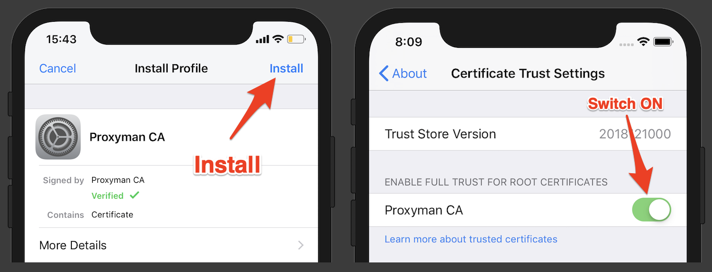

# iOS Device

In order to capture HTTP/HTTPS messages in iOS devices (iPhone, iPad), please navigate to:

* **Certificate** **Menu** -> **Install Certificate on iOS -> Physical Device**

## iOS Setup Guide


⚠️ If you're iOS 16, there is an Apple bug that you could not set the HTTP Proxy. Please check out the [troubleshooting](../troubleshooting/ios-16-devices-issues.md#1.-problem).


<figure><figcaption>
Install Proxyman Certificate on iOS devices
</figcaption></figure>

Let's follow the guidelines:

1. Install **Root Proxyman Certificate** on your machine: You can follow the [macOS Guide](macos.md).
2. Get your iOS Device -> Open Setting app -> Wifi -> Select the current Wifi -> Config the HTTP Proxy by following the next tables.

| Name           | Value                                             |
| -------------- | ------------------------------------------------- |
| Server IP      | Your current IP Network                           |
| Port           | The current port of Proxyman: 9090 is the default |
| Authentication | No                                                |


If you're using any **VPN apps** on macOS or iOS devices, please make sure to close all VPN apps, because they conflict with the HTTPS Proxy config.


&#x20; 3\. Open [http://proxy.man/ssl](http://proxy.man/ssl) or http://cert.proxyman.io by **Safari browser** from your iOS Devices in order to install the Proxyman Certificate.


**http://proxy.man/ssl** or **http://cert.proxyman.io** is a local website, which serves from the local Proxyman's HTTP server. If you can't open it, please forget the wifi, re-connect, and make sure the Proxyman app is opening.

If you can't access it. Please open the support ticket at [Github's repo](https://github.com/ProxymanApp/Proxyman).


&#x20;   4\. From iOS 10.3, we have to explicitly install & trust the Proxyman CA in the Settings app

#### **Install Proxyman CA**

* **iOS ≥ 10.3**: Setting app > General > Profiles > Select Proxyman CA > Install
* **iOS ≥ 12.2**: Setting app > Profiles Downloaded > Select Proxyman CA > Install

#### Trust Proxyman CA

* Setting app > General > About > Certificate Trust Settings > Switch ON on Proxyman CA.


Please make sure we **install** and **trust** the Proxyman CA on your iOS Device. If you have any problem, shoot us an email at **support@proxyman.io** or bump it to [**Github**](https://github.com/ProxymanApp/Proxyman)



If you cannot see any traffic from your iOS Devices, please check out this [troubleshooting](../troubleshooting/my-ios-devices-couldnt-connect-to-proxyman-via-proxy.md)



Make sure that you **delete the certificate on your iPhone** when you're not debugging by Proxyman. If not, your HTTP/HTTPS requests can be intercepted and leak your sensitive data.


## Tutorial

See detailed steps on how to [debug an application on iOS device](https://proxyman.io/blog/2019/06/How-I-use-Proxyman-to-see-HTTP-requests-responses-on-my-iPhone.html) with Proxyman.

### Tired of manual config?

We understand that manually overriding the HTTP Proxy and installing and trusting Proxyman Certificates is painful. Let's check out Atlantis, which is a native iOS framework that helps you do it automatically.


[atlantis-for-ios.md](../atlantis/atlantis-for-ios.md)


## Flutter app?

You might not be able to see the Network Traffic on Proxyman if your app is a Flutter app.

Flutter does not use a system-level proxy, so requests to Proxyman will not be displayed. To do this, you must manually configure your HTTP client used in the code to work with a proxy.

Please follow the solution "Getting Charles to work with Flutter" in [https://flutterigniter.com/debugging-network-requests/](https://flutterigniter.com/debugging-network-requests/)

To find out your local IP, please go to Certificate Menu -> Install Certificate on iOS -> Physical device and get the Server IP and Port
