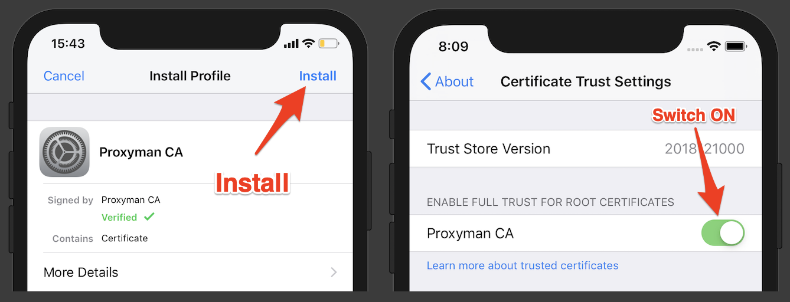

# iOS Device

To capture traffic from an iPhone or iPad, route its Wi-Fi traffic through Proxyman on your computer. HTTPS inspection also requires installing the Proxyman certificate and explicitly trusting it on the device. These are separate steps.

Keep Proxyman running and connect the device to a network that can reach your computer. Use the computer IP address and Proxyman port shown in the setup guide, rather than the device IP address.

Open the physical-device setup guide in Proxyman:

* **Certificate** **Menu** -> **Install Certificate on iOS -> Physical Devices...**


This setup guide works with all real physical devices, including iPhone, iPad, Apple Watch, Apple TV, and Vision PRO.


## iOS Setup Guide

<figure><figcaption></figcaption></figure>

Let's follow the guidelines:

1. Install **Root Proxyman Certificate** on your machine: You can follow the [macOS Guide](macos.md).
2. Get your iOS Device -> Open Settings app -> Wifi -> Select the current Wifi -> Configure the HTTP Proxy by following the next tables.

| Name           | Value                                             |
| -------------- | ------------------------------------------------- |
| Server IP      | Your current IP Network                           |
| Port           | The current port of Proxyman: 9090 is the default |
| Authentication | No                                                |


If you're using any **VPN apps** on macOS or iOS devices, please ensure that you close all VPN apps, as they conflict with the HTTPS Proxy configuration.


&#x20; 3\. Open [http://proxy.man/ssl](http://proxy.man/ssl) or [http://cert.proxyman.io](http://cert.proxyman.io/) in **Safari Web Browser with Private Tab** from your iOS device to install the Proxyman Certificate.


**http://proxy.man/ssl** or **http://cert.proxyman.io** is a local website, which is served from the local Proxyman's HTTP server. If you can't open it, please forget the wifi, reconnect, and make sure the Proxyman app is opening.

If you can't access it. Please open the support ticket at [Github's repo](https://github.com/ProxymanApp/Proxyman).


&#x20;   4\. From iOS 10.3, we have to explicitly install & trust the Proxyman CA in the Settings app

#### **Install Proxyman CA**

* **iOS ≥ 12.2**: On your iPhone -> Open Settings app > Profiles Downloaded > Select Proxyman CA > Install

#### Trust Proxyman CA

Installing the profile does not enable full trust by itself. Complete this step before testing HTTPS traffic:

* Setting app > General > About > Certificate Trust Settings > Switch ON on Proxyman CA.


Please make sure we **install** and **trust** the Proxyman CA on your iOS Device. If you have any problem, shoot us an email at **support@proxyman.io** or bump it to [**Github**](https://github.com/ProxymanApp/Proxyman)



After setup, enable [SSL Proxying](../basic-features/ssl-proxying.md) for the domain and make a new request. If no traffic appears, verify the Wi-Fi proxy IP and port, network connectivity, and VPN settings using the [device connection troubleshooting guide](../troubleshooting/my-ios-devices-couldnt-connect-to-proxyman-via-proxy.md). If requests appear but HTTPS fails, recheck certificate installation and trust.



Make sure that you **delete the certificate on your iPhone** when you're not debugging by Proxyman. If not, your HTTP/HTTPS requests can be intercepted and leak your sensitive data.


## Tutorial

See detailed steps on how to [debug an application on iOS device](https://proxyman.com/posts/2019-06-16-How-I-use-Proxyman-to-see-HTTP-requests-responses-on-my-iPhone) with Proxyman.

### Tired of manual config?

We understand that manually overriding the HTTP Proxy and installing and trusting Proxyman Certificates is painful. Let's check out Atlantis, which is a native iOS framework that helps you do it automatically.


[atlantis-for-ios.md](../atlantis/atlantis-for-ios.md)


## Flutter app?

You might not be able to see the Network Traffic on Proxyman if your app is a Flutter app.

Flutter does not use a system-level proxy, so requests to Proxyman will not be displayed. To do this, you must manually configure your HTTP client used in the code to work with a proxy.

Please follow the solution "Getting Charles to work with Flutter" in [https://flutterigniter.com/debugging-network-requests/](https://flutterigniter.com/debugging-network-requests/)

To find out your local IP, please go to Certificate Menu -> Install Certificate on iOS -> Physical device and get the Server IP and Port
