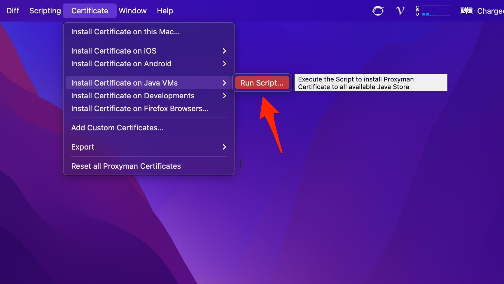

# Java VMs

In order to intercept HTTPS traffic from Java apps, extra steps are required to install the Proxyman CA Certificate into the Java Key Store.

* Intercept Traffic from Unit Test (written by Java or Kotlin)
* Intercept Traffic from Java app or CLI

## 1. Benefit

* Proxyman provides a script to help developers automatically install Root Certificate to Java KeyStore with 1 click ✅
* Support `$JAVA_HOME`
* Support `SDKMAN`
* Support `/usr/libexec/java_home`

## 2. How to use?

### 1. Install Proxyman CA on your Mac

Before installing Proxyman CA on Java VMs, we have to install it properly on your current Mac machine.

Check out the macOS Guideline:


[macos.md](macos.md)


You can skip and start the next step if you've done this step.

## 2. Install Proxyman CA to all Java Key Stores

* Certificate Menu -> Install Certificate on Java VMs -> Run Scripts

* The script will attempt to find the Key Store location from **JAVA\_HOME, SDKHOME,** or from **$(/usr/libexec/java\_home)** environment and install the CA Certificate if possible

<figure><figcaption>
Proxyman install the certificate to all Java Trust Store if possible
</figcaption></figure>


You can find the script at /Applications/Proxyman.app/Contents/Frameworks/ProxymanCore.framework/Versions/A/Resources/install-certificates-java.sh



The script might require permission for EventKit because Proxyman triggers the script by [Apple Script](https://developer.apple.com/library/archive/documentation/AppleScript/Conceptual/AppleScriptLangGuide/introduction/ASLR_intro.html) in order to install it under admin permission.


### Alternative solution

* Check out @[**yauheniprakapenka**](https://github.com/yauheniprakapenka) solution: [https://github.com/ProxymanApp/Proxyman/issues/569#issuecomment-723588490](https://github.com/ProxymanApp/Proxyman/issues/569#issuecomment-723588490) if you get the following error&#x20;

`sun.security.validator.ValidatorException: PKIX path building failed: sun.security.provider.certpath.SunCertPathBuilderException: unable to find valid certification path to requested target javax.net.ssl.SSLHandshakeException: sun.security.validator.ValidatorException: PKIX path building failed: sun.security.provider.certpath.SunCertPathBuilderException: unable to find valid certification path to requested target`
