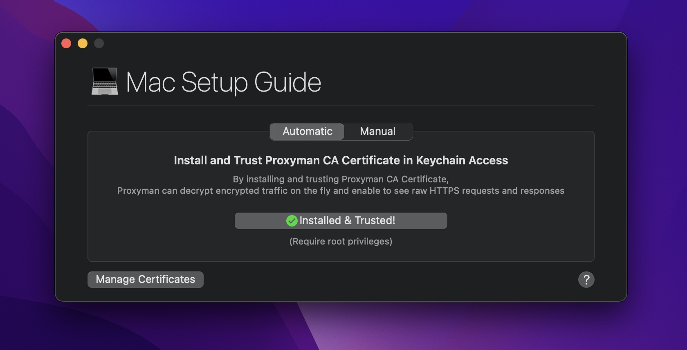
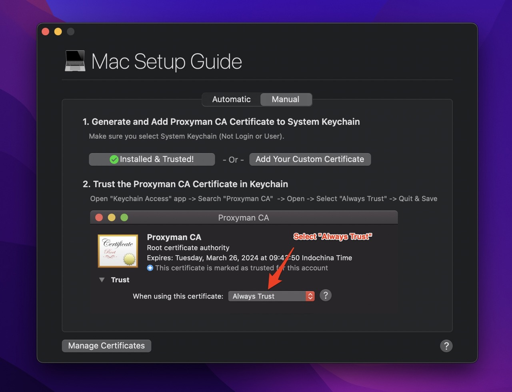

# macOS

## Install & Trust Proxyman Certificates on your Mac

In order to intercept encrypted HTTPS messages (Request or Response), you have to install **Proxyman CA Certificate** on your current machine. This step is mandatory for iOS, Android devices, iOS simulators, Java VMs, and Firefox too.


The Proxyman Certificate is a self-signed certificate that is generated on your machine. Proxyman never stores or transmits any personal data to Proxyman's server or 3rd-party.

Please check out the [Privacy Statement](https://proxyman.io/privacy) to understand what Proxyman obtains or not.

If you'd like to manually generate a Certificate on your machine, then add it to Proxyman. Please check out the [Custom Certificate Doc](../advanced-features/custom-certificates.md#6-how-to-generate-self-signed-certificates-for-custom-root-certificate-that-comply-with-new-apples-security-requirements)



Proxyman's certificate is stored locally at **\~/Library/Application\ Support/com.proxyman.NSProxy/app-data/**


## 1. Automatic mode (recommended)

Proxyman could **automatically** install & trust the Certificate in Keychain by following the below steps:

1. Open the **Certificate** menu
2. Install a Certificate on this Mac...
3. On the Automatic Mode -> Enter your Mac's password (Root Privileges)
4. Verify the status: ✅ `Installed & Trusted` in the button (If not, try to use the Manual Tab, or contact us for further support)
5. Done :white\_check\_mark:




**Automation mode** requires **Root Privileges** to perform the installation script. If you're not sure, please consider using Manual mode.


### How does it work?

In automatic mode, Proxyman will automatically perform two steps:

1. Generate a local Proxyman Certificate at `~/Library/Application\ Support/com.proxyman.NSProxy/app-data/proxyman-ca.pem`
2. Install & Trust the certificate to System Keychain Access. It requires Root Privileges to execute the following CLI:&#x20;


```bash
sudo security add-trusted-cert -d -r trustRoot -k /Library/Keychains/System.keychain ~/Library/Application\ Support/com.proxyman.NSProxy/app-data/proxyman-ca.pem
```


## 2. Manual Mode (Advance)

Proxyman also offers more freedom for super-users who need to install the certificate on their behalf.&#x20;

1. Open the **Certificate** menu
2. Install a Certificate on this Mac... -> Select the Manual Tab
3. Click on the **Generate & Add** button (Proxyman will locally generate the certificate and add it to Keychain, but not Trust it automatically, no Password required)
4. In some cases, System Keychains will ask to select what keychain should be installed -> Select **System Keychain**
5. Open the Keychain Access app on your Mac -> Search "Proxyman CA" -> Open -> Select "Always Trust" -> Quit Keychain and Save


If you've done it correctly, Proxyman will display " ✅ Installed and Trusted" status.





If you'd like to use your own custom Root Certificate, please check out the [Custom Certificate Doc](../advanced-features/custom-certificates.md#6-how-to-generate-self-signed-certificates-for-custom-root-certificate-that-comply-with-new-apples-security-requirements)


Suppose you are not sure how to trust the certificate on the Keychain Access app. You can open the Terminal app and execute the command:


```bash
sudo security add-trusted-cert -d -r trustRoot -k /Library/Keychains/System.keychain ~/Library/Application\ Support/com.proxyman.NSProxy/app-data/proxyman-ca.pem
```



Make sure that you **Delete the Proxyman Certificate in Keychain app** if you're not using Proxyman anymore. If not, anyone who has the Proxyman Certificate can intercept your HTTP/HTTPS requests from your macOS machine.


## 3. Uninstall Proxyman Certificate

1. Open Certificate Menu
2. Reset all Certificates
3. Enter your Mac password and done
