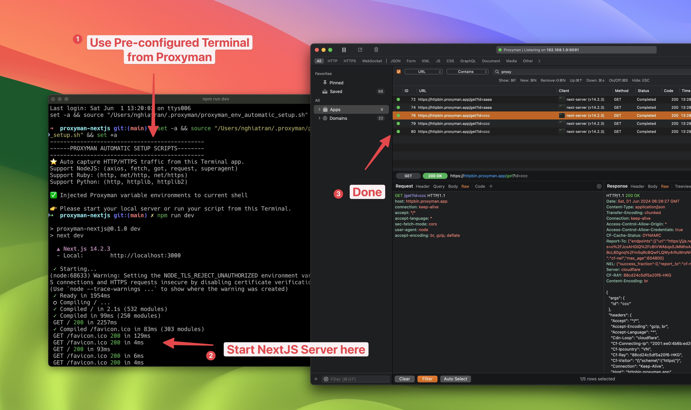

# NextJS (fetch)

## 1. Problem

* Proxyman can't capture any traffic from the \`use server\` from NextJS
* It's because the \`fetch\` from NextJS doesn't respect the System HTTP Proxy. Therefore, no traffic goes through the Proxyman app.

## 2. Solution

1. Start the Pre-configure Terminal on Tools -> Setup -> Automatic Setup -> Click on "Open New Terminal"
2. New Terminal is opened -> Start your NextJS server on this Terminal. For example: \`npm run dev\`
3. Use `no-cache` on `fetch`

```js
export default async function MyPage() {
  const res = await fetch('https://httpbin.org/anything', { cache: 'no-cache' }) // no cache, or no request is sent to Proxyman
  return <div>My Page{res.text()}</div>
}
```

3. Reload your website
4. Done ✅ Your HTTP Traffic is captured by the Proxyman app

<figure><figcaption><p>Capture NextJS fetch on Proxyman</p></figcaption></figure>

## 3. Reference:

* [https://github.com/ProxymanApp/Proxyman/issues/2038](https://github.com/ProxymanApp/Proxyman/issues/2038)
