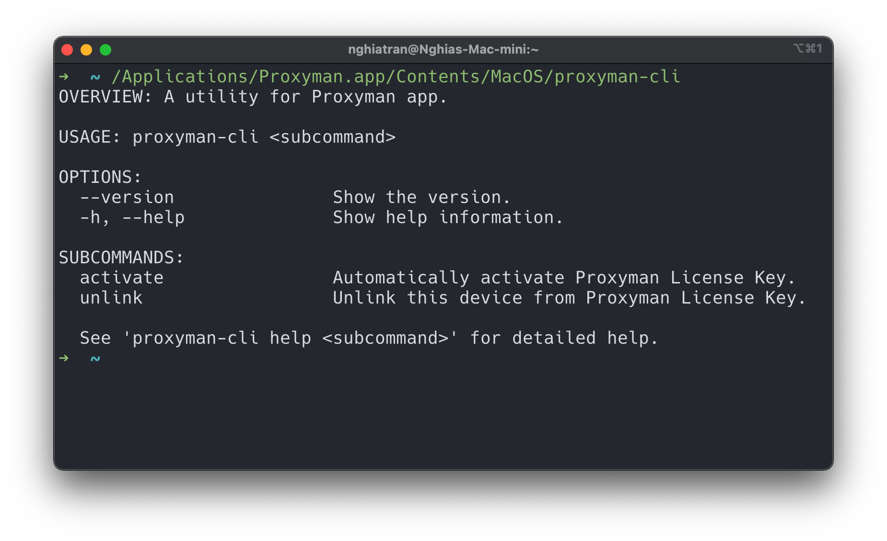

# License

## Proxyman Pro

You can try all debugging tools with the Trial version, which is limited to 2 pinned domains, 2 rules for each debugging tool, and no new tabs.

The **Pro version** comes with:

* A year’s worth of macOS, Windows, and Linux updates
* 1 Mac device per seat
* Premium [Proxyman for iOS](https://proxyman.io/ios) (2 devices per seat)
* Multiple Tabs
* Unlimited Pinned Domains / Apps
* Unlimited rules for all Advanced Debugging Tools (e.g., [SSL Proxying List](https://docs.proxyman.io/basic-features/ssl-proxying), [Map Local](https://docs.proxyman.io/advanced-features/map-local), [Map Remote](https://docs.proxyman.io/advanced-features/map-remote), [Breakpoint](https://docs.proxyman.io/advanced-features/breakpoint), [Allow/Block List](https://docs.proxyman.io/advanced-features/blacklist), [Protobuf](https://docs.proxyman.io/advanced-features/protobuf), [Scripting](https://docs.proxyman.io/scripting/script), [Network Conditions](https://docs.proxyman.io/advanced-features/network-throttling), [Multiple Filters](https://docs.proxyman.io/advanced-features/multiple-filters), [Reverse Proxy](https://docs.proxyman.io/advanced-features/reverse-proxy), [Request/Response Diff](https://docs.proxyman.io/advanced-features/diff), etc).

## Trial Evaluation Duration

* Personal Purpose: No time limit.
* Business Purpose: It's for 2 weeks. After that, please consider purchasing the license.

## Demo Key

If you're a team/company, you can request a 2-week demo key, then please contact support@proxyman.com.

## Buy Proxyman License

Please navigate to the [Pricing page](https://proxyman.io/pricing) for purchasing Proxyman Licenses.

## Manage Proxyman License&#x20;

If you're the owner of the Proxyman license key, you can manage your devices by using the [License Manager](license-manager.md).

## Active License

### macOS/Windows/Linux app

1. After purchasing the Proxyman License, you will receive a license key in your mailbox.&#x20;
2. To activate, please open the Proxyman app (macOS/Windows/Linux) -> Proxyman Menu -> Buy Proxyman Pro.
3. Click on the "Activate License" button and enter your license key

<figure><figcaption><p>Activate License Key on macOS/Windows/Linux app</p></figcaption></figure>

### Activate the License key with your Corporate proxy

* Available from Proxyman macOS 5.5.0 or later
* Some companies have a Corporate Proxy, so can't activate the license key. To make it work, please follow the guide below:

1. Open Tools -> Proxy Setting -> External Proxy
2. Check "Enable External Proxy Tool"
3. Check the HTTP and HTTPS checkboxes
4. For each HTTP and HTTPS: Enter your Proxy Host and Port.
5. If your corporate proxy has the authentication, please enter it.
6. Done ✅
7. Try to activate the License Key again.

<figure><figcaption><p>How to use External Proxy to Activate Proxyman License key</p></figcaption></figure>

### iOS app

Proxyman license key comes with the Proxyman iOS app. 1 seat can be activated on 2 iOS devices.

1. Download the iOS app at App Store: [https://apps.apple.com/us/app/proxyman-network-debug-tool/id1551292695](https://apps.apple.com/us/app/proxyman-network-debug-tool/id1551292695)
2. Open the More Tab (on the Right-Bottom TabBar) -> FaceID & Passcode -> Unlock -> Enter your license key.
3. Done

## Activate License by CLI (macOS Only)

If you have a huge number of licenses, you would like to have an automatic way to activate a license. You can do it too.

1. Download the Proxyman app and copy it to the `/Applications` folder
2. **Open and close the app at least.** It's necessary to set up some configurations.
3. Open Terminal and execute the following cmd:

To **Activate**:

```bash
$ /Applications/Proxyman.app/Contents/MacOS/proxyman-cli activate <key>
```

To **Unlink** device:

```bash
$ /Applications/Proxyman.app/Contents/MacOS/proxyman-cli unlink
```



### Activate by URL

You can also activate a Proxyman license by the URL:

1. Download and open Proxyman at least 1 time.
2. Open the URL in Safari or Google Chrome.

&#x20; `proxyman://activate?key=<key>`

### Remove License

You can remove your license from your devices and then activate it on your new devices as long as you have enough available seats.

#### From your current devices

Open Proxyman app -> Proxyman Menu -> License -> Click on the "Unlink this device" button.

#### With License Manager

1. Open the [License Manager](https://proxyman.io/license-manager/access-link)
2. Enter the email address that you've used to purchase a license
3. Open the access link from your email.
4. Click on the device to remove it.

### Activate License with Cooperated Proxy Server

From Proxyman 4.12.0 or later, you can ask Proxyman to use Cooperated Proxy in a Tools Menu -> Proxy Setting -> External Proxy -> Set HTTP / HTTPS Proxy setting.

