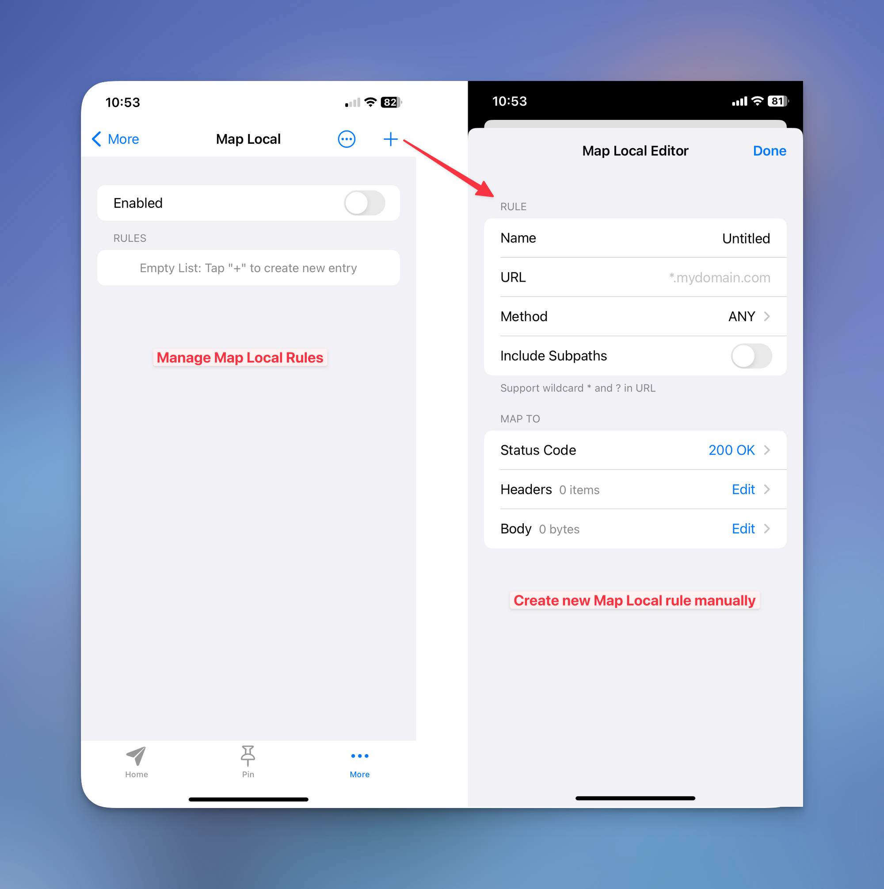

# Map Local for iOS Tutorial

## M**anipulate HTTP(s) response on iPhone using Proxyman Map Local Tool**

Since version 2.0.0, Proxyman has introduced Map Local Tool which enables developers to use the content of local files as a response to your requests, as they match with your rules.

<figure><figcaption></figcaption></figure>

Map Local Tool could significantly boost your speed development and provide the capability to rapidly test on several edge-cased without explicitly updating the data in your server. It’s also the must-have tool for QAs or Developers if you would like to test the app’s behavior with various responses. Some of the testing scenarios:

* Define a Response and use it as a Response for matched Requests
* Quickly try new parameters in responses.
* Test the app’s behaviors with different parameters in the responses.
* Test the UI layout with unusual content.
* Quickly reproduce the bug with specific parameters in responses.
* Mock Fake API with a local File: It's useful for developers would try out the testing APIs which are not in production.

## Prerequisites

* Already downloaded the latest version of Proxyman on AppStore: [https://apps.apple.com/us/app/proxyman/id1551292695](https://apps.apple.com/us/app/proxyman/id1551292695)
* Already installed and trusted Proxyman Certificate on iOS device (If you’re new to Proxyman, please follow [this tutorial](https://proxyman.io/posts/2021-10-17-Getting-Started-With-Proxyman-For-iOS) on how to start intercepting HTTP traffic on your iPhone).

## Create Map Local Rules

There are 2 ways that we can define a Breakpoint rule:

1. From Setting screen

* Go to Setting → map Local → Tap on + button.
* From here we will need to manually fill in all required fields for the Rule, including Title, Method, Matching URL, and include Subpaths or not.

<figure><figcaption></figcaption></figure>

2. From the Menu context

* Long tap on the Request → Add to Map Local List.
* It will automatically fill in all fields to define the Rule based on the selected Request.

<figure><figcaption></figcaption></figure>

#### Modify Header, Status Code and Body

From the Map Local Editor screen, we can freely manipulate the Headers, Status Code and Body data. If we alternate the Body with the new data type, Proxyman will auto-detect the Content-Type and update Headers for us.

<figure><figcaption></figcaption></figure>

## Manipulate Response with Map Local Tool

<figure><figcaption></figcaption></figure>

And you’re all set, it’s time to make another request to see how it works.

If the URL of incoming requests are matching with the **pre-defined matching Rule**, and the Local file is valid => The body response of those matching requests is automatically replaced with the content of the local file.

If the requests are not matching any rules, the entire Response's content remains on the server.

<figure><figcaption></figcaption></figure>

Nicely done! If you look into the flow list, you will find a small blue icon to indicate that this flow has been modified. As you can see, both the Response content has been updated with the local file.

## What’s next

Map Local tool allows you to try various types of responses to test the layout or content from your devices, thus boosting your debugging productivity, but limited by the capability of modifying Response content only. If you'd like to modify the Request content, you might want to check out our [Breakpoint tutorial](https://docs.proxyman.io/proxyman-ios/tutorial-for-ios/breakpoint-for-ios-tutorial) that enables us to manipulate both the Request and Response on the fly without changing any logic from your client.
