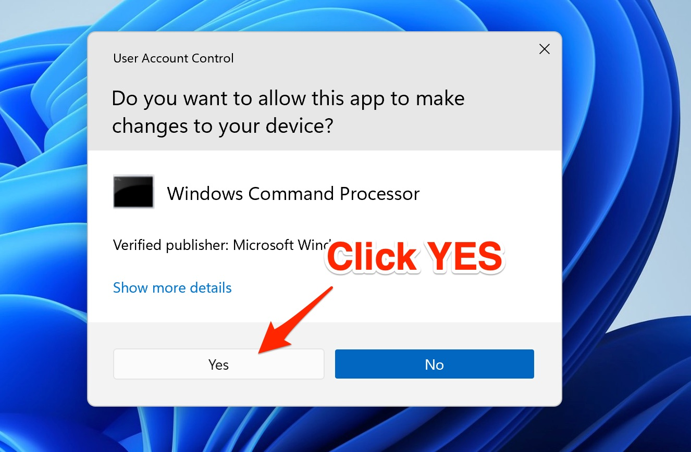
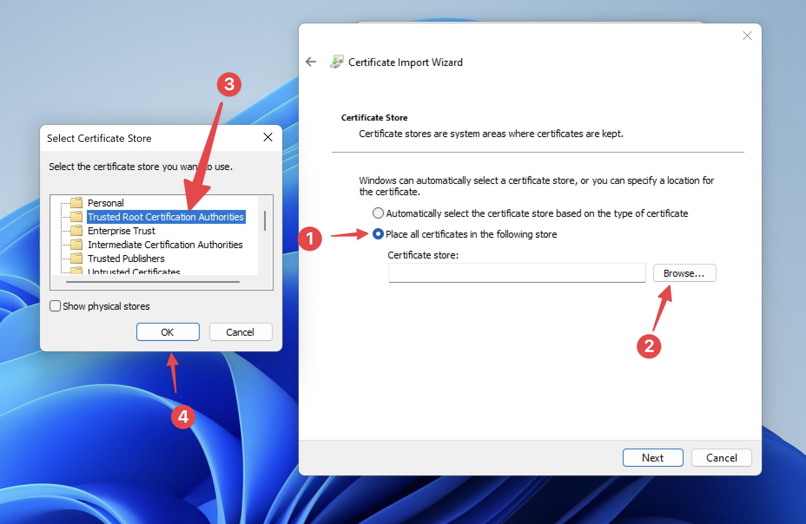

# Install Certificate

## Install Certificates on Windows

In order to intercept encrypted HTTPS messages (Request or Response), you have to install **Proxyman CA Certificate** on your current Windows Machine.

You can install the Proxyman CA Certificate by navigating to

* **Certificate** menu -> **Install Certificate on this Windows**...


The Proxyman Certificate is a self-signed certificate, which is generated on your machine. Proxyman never stores or transmits any personal data to Proxyman's server or 3rd-party.

Please check out the [Privacy Statement](https://proxyman.io/privacy) to understand what Proxyman obtains or not.

If you'd like to manually generate a Certificate on your machine then adding to Proxyman. Please check out the [Custom Certificate Doc](../advanced-features/custom-certificates.md#6-how-to-generate-self-signed-certificates-for-custom-root-certificate-that-comply-with-new-apples-security-requirements)


## 1. Automatic mode

<figure><figcaption><p>Auto install the certificate on Windows machine</p></figcaption></figure>

Proxyman provides an automatic script to Install & Trust the Proxyman CA Certificate to the System.

* Certificate Menu -> Install Certificate for this Windows -> Click on the "Install & Trust" button
* Click YES on the System Prompt

<figure><figcaption><p>Grant permission to run the Automatic Script</p></figcaption></figure>

### Why do I need to grant permission?

Behind the scene, Proxyman would execute the following command with Admin Mode:

```bash
$ certutil -addstore "Root" <Certificate_Path>
```


[certutil](https://learn.microsoft.com/en-us/windows-server/administration/windows-commands/certutil) is a built-in Windows command line to manage the certificate.


## 2. Manual Mode

If you don't have permission to execute the script, please do the following step:

1. Close Proxyman
2. Find a Proxyman CA Certificate at "C:\Users\\\<your\_username>\AppData\Roaming\Proxyman\certificate\certs\ca.cer"
3. Double-click to open it
4. Install Certificate -> Select "Current User" -> Select "Place all certificates in the following store" -> "Browse..."

<figure><figcaption><p>Steps to install the certificate</p></figcaption></figure>

5\. Select Next -> Finish

6\. Select "YES" on the System Prompt.

