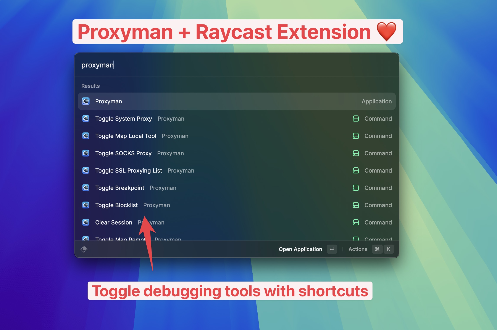

# Raycast

## Raycast Store

Proxyman macOS 5.10.0 supports Raycast Command to quickly control Proxyman.

* Toggle System Proxy
* Toggle Map Local Tool
* Toggle Breakpoint
* Toggle Blocklist
* Toggle Allowlist
* Toggle Map Remote
* Toggle Scripting
* Toggle External Proxy
* Toggle SOCKS Proxy
* Toggle Network Condition
* Toggle SSL Proxying List
* Toggle Record Traffic
* Clear Session

<figure><figcaption>
Proxyman and Raycast
</figcaption></figure>

## Download

* Store: [https://www.raycast.com/noah\_tran/proxyman](https://www.raycast.com/noah\_tran/proxyman)
* Click on the below button 👇

