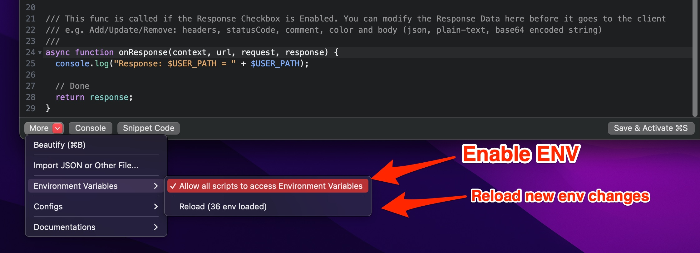

# Environment Variables

## 1. Shared State


This feature is only available on **macOS 10.15+**. Prior to macOS 10.15, it might be crashed.


It's possible to share states from the **onRequest()** and the **onResponse()** from **different scripts** when the script is executed with the global object: **sharedState**

* The **sharedState** is a JS Object (Dictionary), so you can assign any keys and values from **onRequest()**, then receive the data on the **onResponse()** or from **different scripts**.

The following code demonstrates:

* Get the global counter and increase it as soon as the script is executed
* Share data between Request and Response

```javascript
function onRequest(context, url, request) {

  // Save some state to sharedState
  sharedState.url = url;
  sharedState.data = "custom";
  sharedState.info = {"username": "Proxyman"};
  
  // Increase the global counter
  var count = sharedState.count ?? 0;
  count += 1;
  sharedState.count = count;
  
  // Log
  console.log(sharedState);
  return request;
}

function onResponse(context, url, request, response) {

  // Receive it
  console.log("Custom data = " + sharedState.dataa);
  console.log("sharedState.count = " + sharedState.count);
  
  // Done
  return response;
}
```


From Proxyman 2.25.0+, the **sharedState** is available across different scripts. It is only released when quitting Proxyman app or using \`clearSharedState()\`  function.



Prior to Proxyman 2.24.&#x30;**,** the **sharedState** is only alive on the current flow that executes the script and it's released when the script is run over.&#x20;


To clear all data, please consider using \`clearSharedState\` function.

```javascript
// Clear all data from sharedState object
clearSharedState();
```

## 2. Environment Variables

Environment Variables feature is introduced from **Proxyman 3.8.0** and later.

* Scripts can access system env.
* Support bash or zsh.

#### How to use

1. Define an env in your `~/.zshrc` or `~/.bashrc`

```bash
export ACCESS_TOKEN=AAABBBCCC
export PROXYMAN_PATH=/Users/my_user/Desktop/file-mapper
```

2\. Open any scripts -> More button -> Environment Variables -> Allow all scripts to access env.

3\. Reload the ENV to get the env update.



4\. Access env from your script with a prefix `$`

```javascript
async function onResponse(context, url, request, response) {
  console.log($PATH);
  console.log($ACCESS_TOKEN);
  console.log($PROXYMAN_PATH);
 
  // Done
  return response;
}
```

## 3. Additions

* Manually Reload the System Env (Available on Proxyman macOS 4.15.0 or later). Make sure we enable the permission first, in the More Button -> Environment Variables -> Allow all scripts to read env.

```javascript
async function onRequest(context, url, request) {
  // manually reload to get the latest changes
  _reloadEnv();
  
  // get env
  console.log($PROXYMAN_ID)
  
  // Done
  return request;
}

```
