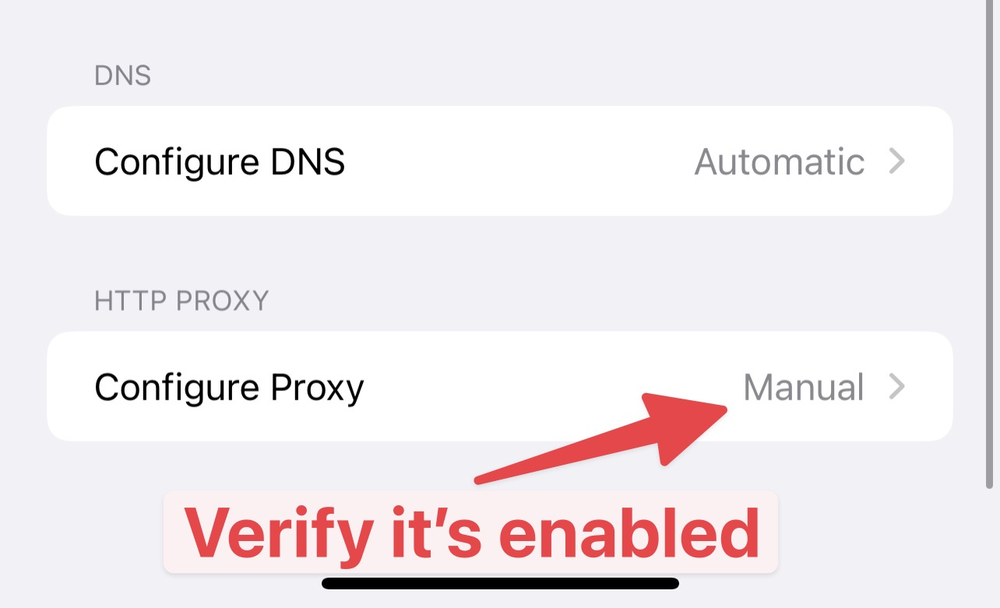

# iOS 16 and iOS 17 issues

### 1. Problem

* iOS 16 or iOS 17 physical devices could not set HTTP Proxy to Proxyman. Setting app -> Current Wifi -> Configure Proxy -> Manual Proxy.
* Proxyman might not capture the traffic from iOS 16/17 devices.

\=> It's an Apple bug.


This issue happens with **Charles Proxy**, Wireshark, Fiddler Everywhere, and other Web Debugging Proxy apps too.



Some users report that it's fixed on iOS 16.3 and later ✅&#x20;

iOS 17 might have the same problem. **Forget this Network** might fix it.

See [Section 4](ios-16-devices-issues.md#4.-solution-for-ios-16.3-or-later) for details.


### 2. How do I know it's a bug from Apple, not Proxyman?

* You can test it by following below steps:

1. Close all Proxyman app
2. Get your iPhone (iOS 16 or later) -> Setting app -> Wifi -> Your Wifi -> Configure Proxy -> Manual Proxy
3. Set any random IP, e.g. 192.168.3.111
4. Set any random Port, e.g 9999
5. Save
6. Open Safari app -> Visit https://google.com
7. Confirm that you can access the Internet.

Since the IP and Port is **invalid**, but you can access the Internet, it indicates that it's Apple's bug 🆘

### 3. Solution for iOS 16.3 or earlier

* Try to forget the Wi-Fi hotspot and restart the device might help.
* Use [Atlantis Framework](https://github.com/ProxymanApp/atlantis) to inspect the network.
* Try to use iOS 15 physical devices.
* Try to use the iOS 16 **Simulator**

### 4. ✅ Solution for iOS 16.3, iOS 17 or later

1. Setting App -> WiFi -> Your WiFi -> <mark style="color:red;">**Forget this Network.**</mark>
2. Setting app -> Wifi -> Your Wifi -> Configure Proxy -> Manual Proxy -> Enter the IP & Port -> Save.
3. Double-check the Configure Proxy Setting

<figure><figcaption></figcaption></figure>

3. Make sure it's \`Manual\`, If it's OFF, try again and Save. Sometimes, the proxy setting is not saved.

### 4. Further discussions

* [https://github.com/ProxymanApp/Proxyman/issues/1293](https://github.com/ProxymanApp/Proxyman/issues/1293)

