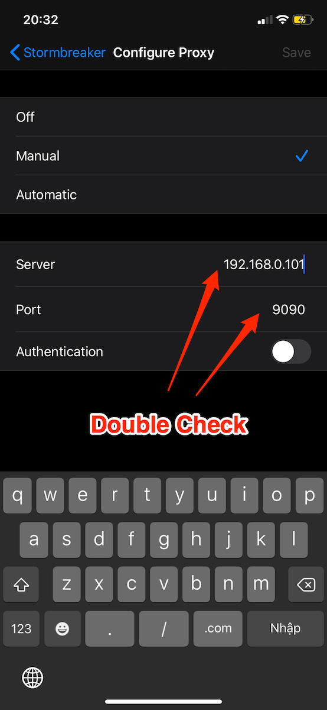
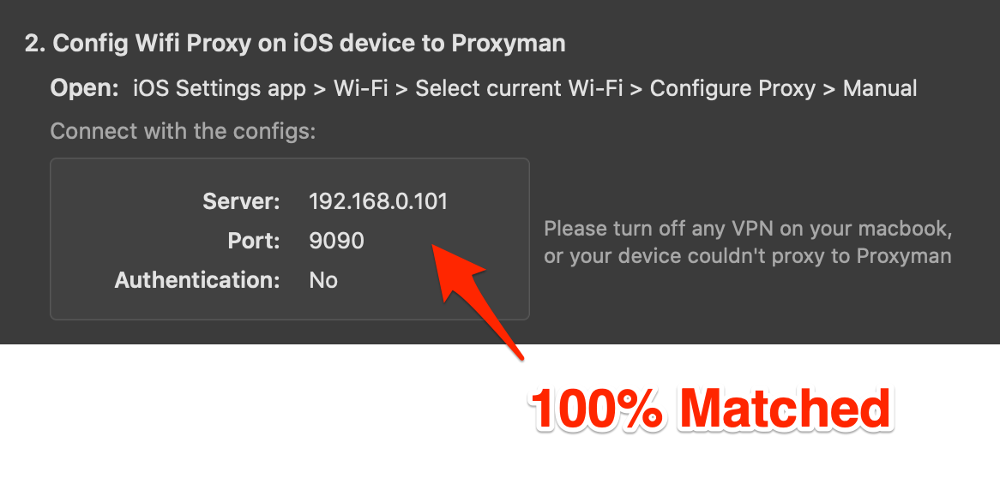
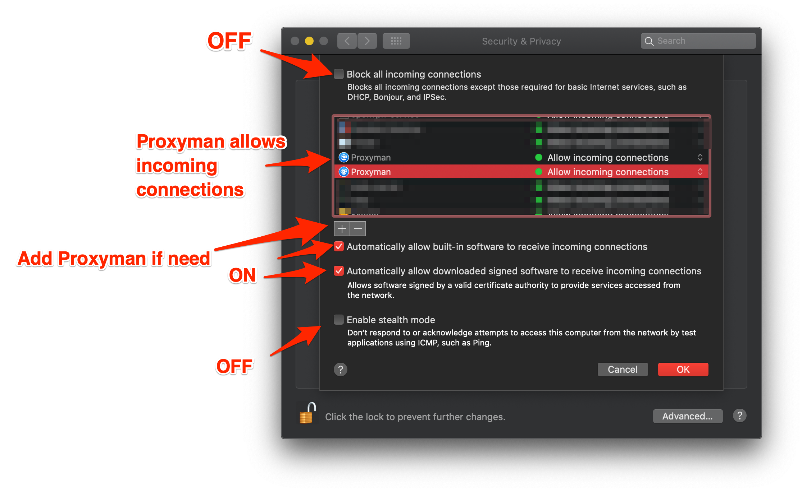
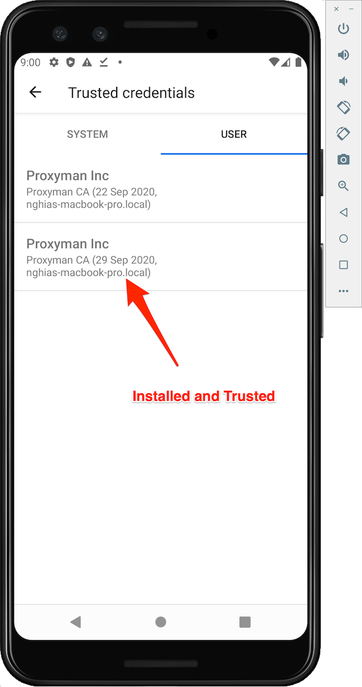
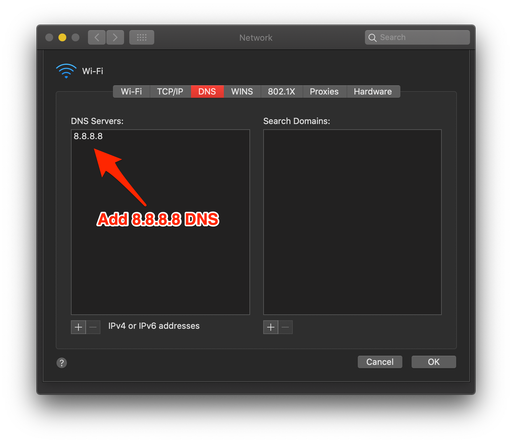

# My Remote Devices (iOS/Android) could not connect to Proxyman?

## **1.** Problems

* ❌ My iOS or Android Devices could not access the Internet after changing the Proxy Config in the Wifi Setting.
* ❌ I can't download the certificate from **http://cert.proxyman.io** or **http://proxy.man/ssl**


For Android, please follow the [second section](my-ios-devices-couldnt-connect-to-proxyman-via-proxy.md#android-devices-and-android-emulator)


## 2. Solution: iOS devices

Please make sure to double-check the following steps:

### 0. Issue with iOS 16 Physical Devices / Simulator

Some reports from Proxyman's users, that **Proxyman** and **Charles Proxy** could not capture any traffic from iOS 16 devices/simulator, even though they config the HTTP Proxy.

It's a bug from iOS, we have to wait for the Apple team to fix it.

To workaround:

#### iOS 16 physical devices:&#x20;

* Forget the network and try to connect again.
* Use [Atlantis Framework](https://github.com/ProxymanApp/atlantis) to capture the traffic
* Use iOS 15 devices

#### iOS 16 Simulator:

* Use iOS 15 Simulators
* Use [Atlantis Framework](https://github.com/ProxymanApp/atlantis) to capture the traffic.


[ios-16-devices-issues.md](ios-16-devices-issues.md)


### 1. Make sure your Mac device and iOS/Android devices are on the same network

If they're on a different network, they are unable to connect to each other.

### 2. Make sure the server IP and Port number must match with Proxyman





### 3. Turn OFF all VPN apps from macOS and iOS/Android devices

By default, the VPN app will **force** all traffic through the VPN server instead of the Proxyman Proxy server (at 9090). Therefore, there are no requests that appear on the Proxyman app.

Turn OFF all VPN apps will fix it:

* For **iOS** Devices: Navigate to Settings -> General -> VPN and make sure the VPN status is **OFF**
* For **Android** Devices: Find the VPN setting on the Settings app and turn it OFF
* For **macOS**: Quit all VPN apps

### 4. Firewall settings (macOS)

By default, a Firewall might block all incoming traffic to your mac. Thus, your remote devices might not be able to connect to Proxyman.

On **macOS**: Navigate to **System Preference -> Security & Privacy -> Firewall tab -> Option**

**Verify that:**

* Block All incoming connections is **OFF**
* Proxyman app **allows incoming connection**
* If there is no Proxyman app, please add the Proxyman app by clicking on + button
* Automatically allow built-in software to receive incoming connection is **ON**
* Automatically allowing downloaded signed software to receive incoming connections is **ON**



### 4. Firewall Setting (Windows 10/11)

Windows 10/11 might block Proxyman, and iPhone/Android devices could not connect to the app. To fix it:

1. Search and open the "Windows Defender Firewall" app -> Click the "Advanced Setting" on the left panel
2. &#x20;Select "Inbound Rules"
3. Find Proxyman.exe -> Double-click to open the setting
4. Select "Allow the Connection" in the General Tab
5. Click OK

<figure><figcaption><p>Allow Proxyman on Windows Firewall</p></figcaption></figure>

### 5. If you're using the Company Network, ask the Security team to open Proxyman's port 9090

Some companies block certain ports by default. Therefore, your iOS devices couldn't access to Proxyman's port at 9090.&#x20;

### 6. Use Private Browser on Safari to open http://cert.proxyman.io or http://proxy.man/ssl

### 7. I'm still unable to connect.

If you follow all the above steps and all configuration is correct but it hasn't resolved your cases yet.

Please try to **ON/OFF your Wifi, Forget the Wifi Network (iOS),** and **Restart the Computer**.

### 8. Still does not work? (iOS app only)

Manual Override the HTTP Proxy, install and trust Proxyman on iOS devices is hard. We understand that. Let's try Atlantis, which is an iOS framework that helps you do it automatically.


[atlantis-for-ios.md](../atlantis/atlantis-for-ios.md)


## Android Devices and Android Emulators

### 1. After setting HTTP Proxy in Wifi Setting, I could not open http://proxy.man/ssl

* [Please follow the above troubleshooting](my-ios-devices-couldnt-connect-to-proxyman-via-proxy.md#1-make-sure-your-mac-device-and-ios-devices-are-on-the-same-network) ☝️&#x20;
* Double-check the Wifi Connection in the Emulator. It must be Connected Status (not Limited Connection or No Internet)

If it happens, please try to **forget the network** and **re-connect the Wifi.**

<div align="center"></div>

### 2. Install and trust Proxyman CA for Android with API 30+

From Android Emulator API 30+, it requires extra steps to trust the Proxyman Certificate

* Open http://proxy.man/ssl from Google Chrome to download the certificate
* Setting app -> Security -> Encryption & Credentials -> Install a Certificate -> CA Certificate -> Install Anyway and Select CA Proxyman Certificate in your storage

You can verify that by opening Trusted Credentials -> User Tab



### 3. My Android Physical Devices or Emulator connection is not stable.

It probably dues to the Android devices/emulators, the only way might fix it is to change the DNS from your Mac or Android Device to **8.8.8.8**

* **On macOS**: Open System Preference -> Network -> Select Wifi -> Advanced -> Select DNS Tab -> Enter **8.8.8.8** on DNS Server Table
* **On Android Device**: Open Wifi Setting -> Set DNS as **8.8.8.8**

Read more at [https://github.com/ProxymanApp/Proxyman/issues/636](https://github.com/ProxymanApp/Proxyman/issues/636)



### 4. The `adb` command not FOUND! when using Android Emulator Automatic Script

If you attempt to override Android Emulator and get the following error:

```
adb command line could not be found!!!
```

Please install the `adb` command line then try again!&#x20;

* [How to install ADB](../debug-devices/android-device/automatic-script-for-android-emulator.md#4-how-does-it-work)

### 5. If you debug with Android Emulator and could not know how to install and trust Proxyman Certificate, please consider using[ Automatic Script for Android Emulator](../debug-devices/android-device/automatic-script-for-android-emulator.md)
